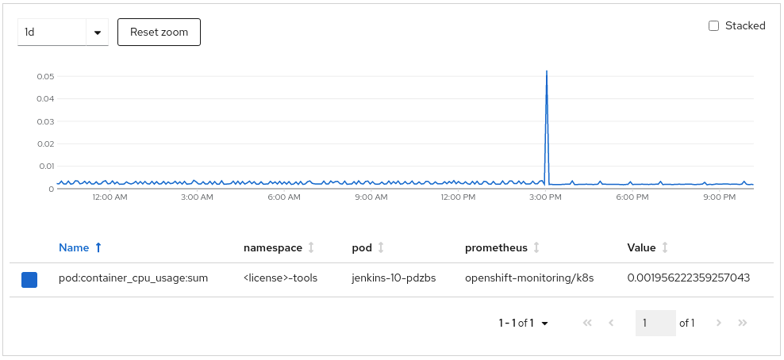
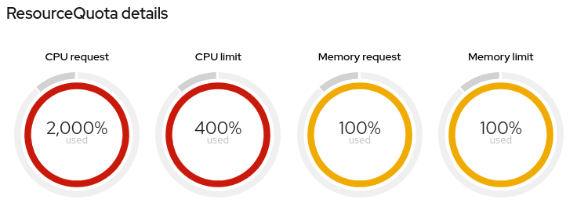
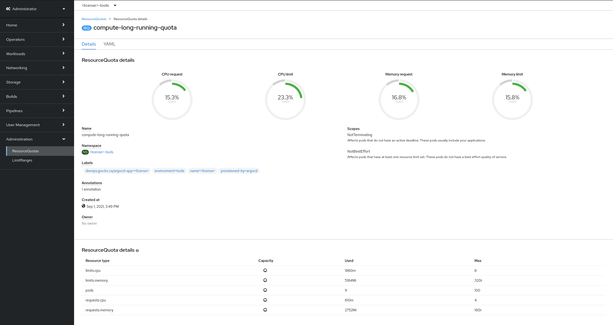

---
title:

description:

keywords: openshift, resources, resource quotas, RAM, CPU, storage, optimization, devops, jenkins, claims, project

page purpose:

audience: developer, technical lead

author: Jonathan Bond

content owner:
---
# OWN PAGE Project Resource Quotas in BC Gov's PaaS (Openshift 4 Platform)

New project sets provisioned in the OpenShift Container Platform (OCP) have the following default resource quotas that include a certain amount of CPU, RAM, and storage:
- **CPU**: 0.5 cores as requested, 1.5 cores as the limit
- **RAM**: 2 GBs as requested, 4 GBs as the limit
- **Storage**: 60 PVC count , 1 GBs overall storage with 521 MBs for backup storage and five snapshots
**Note**: The Platform Services team may approach your team to discuss a downgrade in your quota if they find your application isn't using all of the resources within the current quota.

If the default allocations aren't sufficient for your application, [you can ask for a quota increase](https://developer.gov.bc.ca/Need-more-quota-for-OpenShift-project-set). You'll need a Sysdig dashboard that shows that your application needs more of a specific resource type (CPU, RAM, or storage). Provide this proof to the Platform Services team before they can approve a quota increase.

## CPU quotas:

All CPU requests and limits are shown in cores (not millicores) and represent the maximum for the combined CPU request or CPU limit values for all pods in the namespace.

```
cpu-request-0.5-limit-1.5: CPU Request 0.5 core, CPU Limit 1.5 cores
cpu-request-1-limit-2: CPU Request 1 core, CPU Limit 2 cores
cpu-request-2-limit-4: CPU Request 2 cores, CPU Limit 4 cores
cpu-request-4-limit-8: CPU Request 4 cores, CPU Limit 8 cores
cpu-request-8-limit-16: CPU Request 8cores, CPU Limit 16 cores
cpu-request-16-limit-32: CPU Request 16 cores, CPU Limit 32 cores
cpu-request-32-limit-64: CPU Request 32 cores, CPU Limit 64 cores
```

## Memory quotas:

All Memory requests and limits are shown in GiB and represent the **maximum** for the combined RAM request or RAM limit values for all pods within the namespace.

```
memory-request-2-limit-4: RAM Request 2 GiB, RAM Limit 4 GiB
memory-request-4-limit-8: RAM Request 4 GiB, RAM Limit 8 GiB
memory-request-8-limit-16: RAM Request 8 GiB, RAM Limit 16 GiB
memory-request-16-limit-32: RAM Request 16 GiB, RAM Limit 32 GiB
memory-request-32-limit-64: RAM Request 32 GiB, RAM Limit 64 GiB
memory-request-64-limit-128: RAM Request 64 GiB, RAM Limit 128 GiB
```

## Storage quotas:

All storage sizes are in GiB. All storage quotas include 60 persistent volume claims (PVCs).

```
storage-1: Overall Storage: 1 GiB, Backup Storage: 0.5 GiB
storage-2 Overall Storage: 2 GiB, Backup Storage: 1 GiB
storage-4 Overall Storage: 4 GiB, Backup Storage: 2 GiB
storage-16 Overall Storage: 16 GiB, Backup Storage: 8 GiB
storage-32 Overall Storage: 32 GiB, Backup Storage: 16 GiB
storage-64 Overall Storage: 64 GiB, Backup Storage: 32 GiB
storage-128 Overall Storage: 128 GiB, Backup Storage: 64 GiB
storage-256 Overall Storage: 256 GiB, Backup Storage: 128 GiB
storage-512 Overall Storage: 512 GiB, Backup Storage: 256 GiB
```

# OWN PAGE Resource Tuning Recommendations

# Application Resource Tuning

Deploying an application with appropriate CPU and memory [requests and limits](https://docs.openshift.com/container-platform/3.11/admin_guide/overcommit.html#requests-and-limits) is critical for the following:
- Ensures resource availability for your applications
- Ensures resource availability for other tenant applications
For more information, see the [Resiliency Guidelines](https://developer.gov.bc.ca/Resiliency-Guidelines#a-correctly-resourced-app).

While [resource quotas](NEW LINK) are quite generous, these quotas are a tool to allow tenants enough resources to temporarily burst usage for experimentation, rather than an upper limit of consistent use. The platform isn't sized to support every tenant fully using their resource quota.

* **Resource requests**: Resource requests are guaranteed and reserved for the pod. Scheduling decisions are made based on the request to ensure that a node has enough capacity available to meet the requested value.

* **Resource limits**: Resource limits set an upper limit of what a pod can reach if the resources are available on the node.

## Setting Requests and Limits

If you set a resource limit, you should also set a resource request. Otherwise, the request matches the limit. For example, a deployment without a defined CPU request and a defined CPU limit of one core results in a pod with a request of one CPU and a limit of one CPU.

Use the following best practices for requests and limits:
* Set requests and limits.
* Set requests to the minimum of what your application needs.
* Set reasonable limits for what a single pod should support.
* Use horizontal pod autoscalers where possible, rather than large CPU and memory limits.

### Best practices for the platform community
Follow these best practices for the good of the platform community:
* A **3:1 ratio** for **CPU limit:CPU request** is a good starting place for new applications that haven't yet been tuned.
* A **2:1 ratio** for **CPU limit:CPU request** is a great next step for teams whose projects are working and stable and who can start tuning their application more effectively, especially those who are seeking to make better use of horizontal scaling.
* A **1.5:1 ratio** for **CPU limit:CPU request** is an amazing goal for teams who have already started tuning their applications and are looking to make the best possible use of the platform's capabilities.

For more information and an example of resource tuning for a sample OpenShift application, watch [this video](https://www.youtube.com/watch?v=rkxVZgn9icU).

### Best practices for requests and limits

If you don't specify a  request or limit, your pods are deployed with the following defaults:

* **CPU request**: 100 millicores (m)
* **CPU limit**: 250 m
* **Memory request**: 256 mebibytes (Mi)
* **Memory limit**: 1 gibibytes (Gi)

This is not the same as specifying a resource request or limit of zero.

If you set the request or limit to zero, your pods run under the `BestEffort QoS` class and use whatever spare capacity is available on the node.

You must assign a request or limit to zero through the CLI or directly in the manifest. The web console doesn't accept `0` as a request or limit while editing the resources on a deployment. Instead, it applies the platform defaults outlined in the previous answer.

#### Deployments
If you create a deployment and only specify a limit, your pods are deployed with a request identical to the limit.

If you create a deployment and only specify a request, your pods are deployed with the configured request. The default limit is the following:
* **CPU limit**: 250 m
* **Memory limit**: 1 Gi

#### CPU consumption
If you want to check the actual CPU consumption of running pods in your project, you can use the `oc` client instead of the web console. You'll have to use additional math, as there isn't a way to automate this cross platform using `oc`.

```console
$ oc adm top pod
NAME              CPU(cores)   MEMORY(bytes)
<redacted>        3m           285Mi
<redacted>        3m           299Mi
<redacted>        3m           285Mi
<redacted>        0m           13Mi
<redacted>        9m           61Mi
<redacted>        4m           98Mi
<redacted>        0m           28Mi
<redacted>        2            26Mi
```

Add the numbers under `CPU(cores)`. As the `m` stands for millicores, add up the numbers and divide by 1000 to get the actual consumption of CPU cores by the pods in the current project. If the CPU usage has no `m` suffix, then it's measured in cores, and not millicores.

For the previous example, the total would then be `2 + (3+3+3+9+4)/1000 = 2.022` CPU cores of actual CPU consumption.

You can use `oc` to get the current value of CPU requests allowed for the current project logged in with `oc`. Use the following command to show the current value of CPU requests allotted for the current project:

```bash
oc get quota compute-long-running-quota -o=custom-columns=Requests:.status.used."requests\.cpu"
```
You'll get the following output:
```console
Requests
14500m
```
Divide the number by 1000. The CPU requests value is 14.5 CPU cores.

## Jenkins resource configuration

Tuning the resources of Jenkins deployments can have a large effect on available resources of the platform. Jenkins accounts for the largest user of CPU requests and limits on the platform. Recent analysis indicates the following:

- **15% to 25% of CPU requests** on the platform are related to Jenkins
- **7% of the CPU requests** are actually used, on average, over one day
- **10% or more CPU requests** for the overall platform can be saved by tuning Jenkins resources

### Recommended configuration

The Platform Services team recommends the following for Jenkins deployments:

- **CPU request**: 100 m
- **CPU limit**: 1000 m (may vary depending on usage)
- **Memory request**: 512 Mi
- **Memory limit**: 1 to 2 Gi (may vary depending on usage)

On a typical Jenkins deployment, you can use the following snippet if you're editing the yaml:

```YAML
        resources:
          requests:
            cpu: "100m"
            memory: "512Mi"
          limits:
            cpu: "1"
            memory: "1Gi"
```

Use the following command to update a Jenkins `DeploymentConfig`:

```bash
oc patch dc/jenkins -p '{"spec": {"template": {"spec": {"containers":[{"name":"jenkins", "resources":{"requests": {"cpu":"100m", "memory":"512Mi"}, "limits": {"cpu":"1", "memory":"1Gi"}}}]}}}}'
```

### Performance Testing Details

Jenkins is often deployed with high CPU and memory requests due to previous scheduler issues that are resolved. The templates **and existing Jenkins deployments** should be tuned to reduce the CPU requests.

A test was performed to collect the startup time of Jenkins under various resource configurations. Each test was performed 3 times and the startup time was averaged out across each iteration. The name of each test is in the format of `[cpu_requests_in_millicores]-[cpu_limits_in_millicores]-[memory_requests_in_mb]`.


| Test Name                  | Average Startup Time (s) |
|----------------------------|--------------------------|
| 100m-req-500m-limit-128m   |                      295 |
| 100m-req-500m-limit-512m   |                      248 |
| 100m-req-500m-limit-128m   |                      368 |
| 100m-req-1000m-limit-128m  |                      163 |
| 100m-req-500m-limit-512m   |                      185 |
| 100m-req-1000m-limit-512m  |                       77 |
| 100m-req-2000m-limit-512m  |                       80 |
| 500m-req-1000m-limit-128m  |                      137 |
| 500m-req-1000m-limit-512m  |                       91 |
| 1000m-req-2000m-limit-128m |                      131 |
| 1000m-req-2000m-limit-512m |                       73 |

The observations from the testing can be summarized as follows:

- CPU Limit has the largest effect on Startup Performance
- CPU Request has little effect on Startup Performance
- The gain from a CPU Limit of 500m to 1000m is major
- The gain from a CPU Limit of 1000m to 2000m is minor
- One ideal configuration looks like this:
  - CPU Request: 100m
  - CPU Limit: 1000m+
  - Memory Request: 512M
  - Memory Limit: 1-2GB (May vary depending on usage)

### Advanced Jenkins Resource Tuning

Consider monitoring the upper and lower bounds of CPU and memory usage of Jenkins instances over time. When idle, it has been observed that Jenkins uses under `5m` of CPU and about `650Mi` of memory. As per the **General Guidelines** above, "set requests to the *minimum* of what your application needs." It is ideal to reserve resources conservatively (especially for workloads that are often idle), and leverage resource limits to burst when active.



Also, consider other workloads you may need to run in the tools namespace when accounting for requests/limits allocation to be within the allotted maximums.

## Tools Namespaces Resource Quota Recommendations

Every product in a cluster is provided a license plate and a namespace for each environment (i.e., dev, test, prod). These products also have a **tools** namespace defined as `<license>-tools`, where tooling such as Jenkins are deployed.

As of writing, there is a discrepancy between compute resources (especially CPU) requested compared to actual usage.

Jenkins instances in tools namespaces across the cluster are requesting much more resources than they are utilizing on average. These overcommitted Jenkins instances are one of the largest contributors to this over-allocation problem.

In short, the recommendation is to lower compute resource requests and leverage resource limits in a burstable fashion.

This section identifies the problem and mitigation recommendation of resource over-allocation in tools namespaces.

### Decoupling Tools Namespaces Quotas and Limit Ranges

Currently, all namespaces provided to a product in a cluster are assigned the same T-shirt-sized resource quotas and limit ranges.

It is recommended to decouple the quotas and limits sizing of the tools namespace from the other environment namespaces (i.e., dev, test, prod) to adjust only the quotas and limits of the tools namespaces separately.

### Tools Namespaces Quota Tuning

While teams are encouraged to patch the CPU and memory requests and limits of existing tools (i.e., Jenkins instances) to reduce over-allocation of resources, current resource quotas do not enforce this. Reducing resource quotas in the tools namespaces will dissuade and prevent this practice moving forward.

#### Tools Namespaces Quota Sizing Recommendation

According to Cost Management and OpenShift Monitoring, the median CPU usage (per pod) is below `10m` on average (including idling). Namespace-wide CPU usage was measured at about `50m`-`100m` on average (some exceptions below or above).

This allocation affects the `compute-long-running-quota` `ResourceQuota`. Modifying or creating a new based on this resource quota will be required to reduce current maximums for the tools namespaces.

Based on these statistics, it is recommended to reduce CPU requests and limits in the `compute-long-running-quota` `ResourceQuota`. To start, CPU requests may be dropped to as low as `500m`, and potentially lower after evaluating with time if this change does not inhibit work. CPU limits should be several multiples of the proposed CPU requests (i.e., `2000m`, `4000m`, `8000m`, or more) depending on realistic CPU usage of the average tools namespace workload when experiencing high load.

However, as this is a substantial difference from current tools namespaces quota sizing, refer to [Tools Namespaces Quota Reduction Process](#tools-namespaces-quota-reduction-process) for considerations to alleviate undesired outcomes.

As of writing, oversized CPU requests are the focus of concern. Memory is an incompressible resource that cannot be throttled as with CPU. If reduction of memory allocation is also considered, a conservative approach should be applied to lessen the risk of pod evictions and `OOM`-based termination.

#### Tools Namespaces Quota Reduction Process

Consider lowering resource quotas incrementally (i.e., reduce resource maximums by 25% of original value every 2 weeks). This is to mitigate issues that may arise for consumers of the tools namespaces and monitor any increases of pod evictions or `OOM`-based termination. This approach can indicate (less detrimentally) when a resource quota is becoming too small.

Reducing a resource quota will not impact running workloads immediately. If the sum of any resource constraints will be above the allotted after modifying the quota, running workloads will **not** be terminated or modified in any way. The resource quota will display over resource requests/limits, as in the example below:



Existing pods that are terminated (manually or by other means) will not be rescheduled if resource requests/limits cannot be satisfied. Patching a `Deployment(Config)` will terminate any existing pod(s). If new pods do not come up, the configured resource requests/limits may need to be adjusted to accommodate the resized resource quota.

Because resource quota changes do not impact existing pods, coordination with teams during this transition process will be crucial to ensure workloads are patched accordingly and will redeploy within the bounds of the resource quota.

### OpenShift Templates Consideration for Reduced Quota

When deploying a workload such as Jenkins from the OpenShift Catalog, you may not be prompted to configure all of the CPU and memory requests and limits. In the case of Jenkins, you may only define the memory limit (defaults to 1Gi) which will set the memory requests to the same value.

To accommodate a reduced project quota, the `oc patch` command (depicted above) should be used with more appropriate CPU and memory requests and quotas for all workloads in the tools project. Otherwise, these workloads may not become schedulable if their combined total requests/limits exceed the maximums defined by project quotas.

### Viewing Quota Usage

You can identify current resource quota consumption and properly size resource requests and limits of existing/new workloads using either the OpenShift web console or `oc` command-line tool.

#### Viewing Quota Usage (GUI)

From the OpenShift web console, in the **Administrator** perspective, proceed to **Administration** > **ResourceQuotas** and select the appropriate `ResourceQuota` (i.e., `compute-long-running-quota`). Here is an example:



#### Viewing Quota Usage (CLI)

To describe a specific quota, use the `oc` tool:

```console
$ oc describe resourcequotas compute-long-running-quota # -n <project>
Name:       compute-long-running-quota
Namespace:  <license>-tools
Scopes:     NotBestEffort, NotTerminating
 * Matches all pods that have at least one resource requirement set. These pods have a burstable or guaranteed quality of service.
 * Matches all pods that do not have an active deadline. These pods usually include long running pods whose container command is not expected to terminate.
Resource         Used    Hard
--------         ----    ----
limits.cpu       1860m   8
limits.memory    5184Mi  32Gi
pods             9       100
requests.cpu     610m    4
requests.memory  2752Mi  16Gi
```

### Risks Reducing Resource Reservation

Consider these risks when reducing resource quotas (and subsequently, requests/limits).

See [Configuring your cluster to place pods on overcommitted nodes](https://docs.openshift.com/container-platform/latest/nodes/clusters/nodes-cluster-overcommit.html) for more details.

#### Simultaneous Resource Claiming

Reducing resource requests ["works on the assumption that not all the pods will claim all of their usable resources at the same time"](https://cloud.redhat.com/blog/full-cluster-part-2-protecting-nodes).

Consideration must be made to determine if several workloads across the cluster would be bursting above their requests, simultaneously at a specific time of day.

#### Node CPU Saturation

Very low CPU requests (i.e., `5m`) may be assigned to workloads such as Jenkins that have minuscule CPU usage when idle, and rely on CPU limits to burst during pipeline runs. A potential risk with this configuration is if the node a workload is scheduled on is being heavily utilized, the workload will not be able to burst much higher than the given CPU requests, potentially causing a significant slowdown.

However, this will not cause pod evictions, and CPU throttling (extensively below CPU limits) can be mitigated ensuring nodes across the cluster are evenly balanced and not overutilized.

#### Node Memory Saturation

Nodes running out of memory can be more troublesome than CPU saturation. Regardless of node capacity, workloads that consume beyond their configured memory limits will immediately be terminated. However, if the workload is above its memory requests (but within its memory limits) and its node is running out of memory, the workload may be evicted (depending on the scheduler and priority) to reclaim that memory.

Because memory is incompressible, memory requests and limits should be a little more generous to mitigate pod eviction/termination.

# OWN PAGE Need more quota for OpenShift project set?

# I need more quota, or do I?

Is your application failing to scale due to resource limit? Are you seeing OOM pod kill? Is your PVC almost full? Before requesting for more quota to your project set, please double check if the application is fully utilizing the resources and confirm that the usage is expected. Here are some good reading that will help you to determine on the level of resource the application needs:
- [Resource Management Guidelines](https://github.com/BCDevOps/developer-experience/blob/master/docs/ResourceManagementGuidelines.md)
- [Application Resource Tuning](https://github.com/BCDevOps/developer-experience/blob/master/docs/resource-tuning-recommendations.md)

## First thing first: setup resource monitoring with Sysdig Monitor

Begin a monitoring journey with Sysdig, where you can access dashboards showing your application memory, CPU and storage usage. Before connecting with us for the quota increase request, we will ask you to start monitoring and collecting metrics to show your application resource utilization status. Refer to our Sysdig documentation for self-serve onboarding [here](https://developer.gov.bc.ca/OpenShift-User-Guide-to-Creating-and-Using-a-Sysdig-Team-for-Monitoring). It has all you would need to onboard onto Sysdig and make use of the default dashboards that get created automatically. Should you have any trouble with it, please reach out to us on [Rocketchat channel](https://chat.developer.gov.bc.ca/channel/devops-sysdig)!

> A side note: Sysdig is a great and powerful tool for service monitoring and applying SRE practice! Having you to get started using Sysdig is not just for this one time quota request, but with the goal to leverage it for service monitoring and alerting purpose for the long run.

**Now if you are pretty sure that you do need a quota increase, please continue!**

Resource quota increase can be requested by a Product Owner or a Tech Lead of the project on the project edit page in [Openshift 4 Project Registry](https://registry.developer.gov.bc.ca/public-landing) and will **require the approval** by the Platform Service Team before it is processed.  

Teams requiring more resources in any of the 3 resource categories such as CPU/RAM/Storage in any of the 4 namespaces (dev, test, tool or prod), will have to submit a standard quota increase request through the Project Registry. Refer to [OCP 4 resource quota definition](https://developer.gov.bc.ca/Project-Resource-Quotas-in-BC-Gov's-PaaS-(Openshift-4-Platform)) for more details on each level of quota set. Once the quota increase request is approved (see below what information is required before the request can be approved), the namespaces specified will be upgraded to the next quota size.

## What does the Platform Services Team need to know?

Before we provide more resources for you, we need to know if you are making good use of the current quota and any expected load increase to your application.

If you are currently running out of quota, we'd like to see some statistics of resource consumption and utilization. If you are getting prepared for an application load increase, we'd like to know the expected increase and how much growth room you still have.

There are three different types of resource on the platform:
1. CPU
2. Memory (aka RAM)
3. Storage

### Step 1:

Some background for the quota increase request, such as:
- what have you tried to reduce the current resource consumption
- what are the use case for the requested quota increase

### Step 2:

Show us some resource monitor of the components you have in the namespaces. We'd like to know what level resource consumption is with your application and how well they are utilizing resources.

Here are some things to note:
- resource monitoring/collection should be in span of at least a week, or long enough to see the pattern
- consider each component in the namespace, whether that is a part of the application or devops tools


**Part 1 - Compute Resource Quota Increase**

If you are requesting for CPU or Memory quota increase, please collect the average from each replica pods and fill in the table. Also present the Sysdig dashboard so we can leverage on more accurate figures to make the decision! See the following as an example:

| Component name | Description (Optional) | # of Replicas (and range if using auto scaler) | Resource Requested | Resource Limit | Average Consumption | Spikes |
|----------------|------------------------|------------------------------------------------|--------------------|----------------|---------------------|--------|
| RocketChat app | platform chat app | 3 (HPA min 3 max 5) | 1 core CPU | 1.5 cores CPU | 1 core | 1.4 cores |


**Part 2 - Storage Quota Increase**

If you are requesting for an increase of a storage quota, list all the PVCs that you have and the components that are mounting the volume, together with the sysdig dashboard that shows the past usage metrics. We'd like to know what they are used for and its utilization. See the following as an example:

| Component name | Description (Optional) | PVC type | PVC size | Storage Utilization |
|----------------|------------------------|----------|----------|---------------------|
| RocketChat DB patroni statefulset | to store persistent data | netapp-file-standard | 5Gi | 80% |

*Note: provide monitoring data or screenshots if needed*


### Step 3:

Conclude what is the current level of resource consumption and compare with the quota. Also explain in details on how much more quota is required, and for what usage.

Here are some things to include:
- current quota in project set
- total CPU/memory/storage used currently
- expected quota increase amount and detailed allocation plan


### Step 4:
Send the above to Platform Services team at PlatformServicesTeam@gov.bc.ca. Someone from the team will follow up with you soon!

When requesting a quota increase for more than one increment, book a 30 min meeting with the Platform Services Team (send the invite to Olena Mitovska, our Platform PO and she will pull in team's operations experts as needed). The Platform Services Team will be looking for an overview of the application design and architecture that clearly demonstrate why more resources are required for its operations.

If you have a need to store a large amount of **unstructured data**, you may want to consider to leverage the [S3 Object Storage Service](https://github.com/BCDevOps/OpenShift4-Migration/issues/59) provided by Enterprise Hosting.


---
Related links:
*

Rewrite sources:
* https://github.com/BCDevOps/developer-experience/blob/master/docs/resourceTuning/project-resource-quotas.md
* https://github.com/BCDevOps/developer-experience/blob/master/docs/resource-tuning-recommendations.md
* https://github.com/BCDevOps/developer-experience/blob/master/docs/resourceTuning/request-for-quota-increase.md
---
