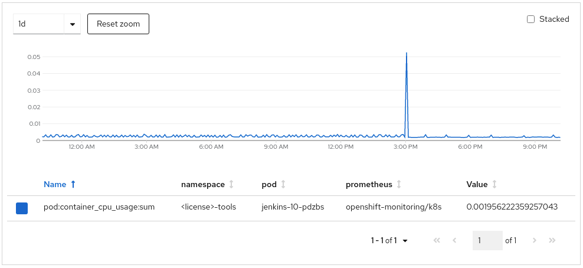
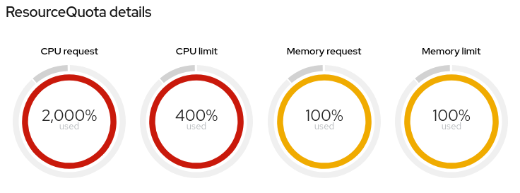
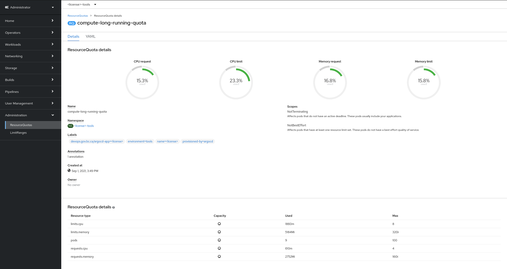

---
title:

description:

keywords: openshift, resources, resource quotas, RAM, CPU, storage, optimization, devops, jenkins, claims, project

page purpose:

audience: developer, technical lead

author: Jonathan Bond

content owner:
---

<!-- From OM:
I suggest to skip this particular page for now as we have a RedHat engineer developing a topic on resource tuning for the new Openshift 201 training that our team will be delivering. This page contains resource tuning guidelines that we as a team tthought were appropriate, but I think it makes sense to wait and see what the expert recommends. It might be that his recommendations will align with ours and the content in this page will still stand but it might be that his recommendations will differ from ourself and in this case the page will need to be rewritten. So that you dont have to rewrite it twice, lets put it aside until the next week. I expect to see the first draft of the resource tuning topic from RedHat on Friday
-->
# HOLD Resource tuning recommendations

# Application Resource Tuning

Deploying an application with appropriate CPU and memory [requests and limits](https://docs.openshift.com/container-platform/3.11/admin_guide/overcommit.html#requests-and-limits) is critical for the following:
- Ensures resource availability for your applications
- Ensures resource availability for other tenant applications
For more information, see the [Resiliency Guidelines](https://developer.gov.bc.ca/Resiliency-Guidelines#a-correctly-resourced-app).

While [resource quotas](NEW LINK) are quite generous, these quotas are a tool to allow tenants enough resources to temporarily burst usage for experimentation, rather than an upper limit of consistent use. The platform isn't sized to support every tenant fully using their resource quota.

* **Resource requests**: Resource requests are guaranteed and reserved for the pod. Scheduling decisions are made based on the request to ensure that a node has enough capacity available to meet the requested value.

* **Resource limits**: Resource limits set an upper limit of what a pod can reach if the resources are available on the node.

## Setting Requests and Limits

If you set a resource limit, you should also set a resource request. Otherwise, the request matches the limit. For example, a deployment without a defined CPU request and a defined CPU limit of one core results in a pod with a request of one CPU and a limit of one CPU.

Use the following best practices for requests and limits:
* Set requests and limits.
* Set requests to the minimum of what your application needs.
* Set reasonable limits for what a single pod should support.
* Use horizontal pod autoscalers where possible, rather than large CPU and memory limits.

### Best practices for the platform community
Follow these best practices for the good of the platform community:
* A **3:1 ratio** for **CPU limit:CPU request** is a good starting place for new applications that haven't yet been tuned.
* A **2:1 ratio** for **CPU limit:CPU request** is a great next step for teams whose projects are working and stable and who can start tuning their application more effectively, especially those who are seeking to make better use of horizontal scaling.
* A **1.5:1 ratio** for **CPU limit:CPU request** is an amazing goal for teams who have already started tuning their applications and are looking to make the best possible use of the platform's capabilities.

For more information and an example of resource tuning for a sample OpenShift application, watch [this video](https://www.youtube.com/watch?v=rkxVZgn9icU).

### Best practices for requests and limits

If you don't specify a  request or limit, your pods are deployed with the following defaults:

* **CPU request**: 100 millicores (m)
* **CPU limit**: 250 m
* **Memory request**: 256 mebibytes (Mi)
* **Memory limit**: 1 gibibytes (Gi)

This is not the same as specifying a resource request or limit of zero.

If you set the request or limit to zero, your pods run under the `BestEffort QoS` class and use whatever spare capacity is available on the node.

You must assign a request or limit to zero through the CLI or directly in the manifest. The web console doesn't accept `0` as a request or limit while editing the resources on a deployment. Instead, it applies the platform defaults outlined in the previous answer.

#### Deployments
If you create a deployment and only specify a limit, your pods are deployed with a request identical to the limit.

If you create a deployment and only specify a request, your pods are deployed with the configured request. The default limit is the following:
* **CPU limit**: 250 m
* **Memory limit**: 1 Gi

#### CPU consumption
If you want to check the actual CPU consumption of running pods in your project, you can use the `oc` client instead of the web console. You'll have to use additional math, as there isn't a way to automate this cross platform using `oc`.

```console
$ oc adm top pod
NAME              CPU(cores)   MEMORY(bytes)
<redacted>        3m           285Mi
<redacted>        3m           299Mi
<redacted>        3m           285Mi
<redacted>        0m           13Mi
<redacted>        9m           61Mi
<redacted>        4m           98Mi
<redacted>        0m           28Mi
<redacted>        2            26Mi
```

Add the numbers under `CPU(cores)`. As the `m` stands for millicores, add up the numbers and divide by 1000 to get the actual consumption of CPU cores by the pods in the current project. If the CPU usage has no `m` suffix, then it's measured in cores, and not millicores.

For the previous example, the total would then be `2 + (3+3+3+9+4)/1000 = 2.022` CPU cores of actual CPU consumption.

You can use `oc` to get the current value of CPU requests allowed for the current project logged in with `oc`. Use the following command to show the current value of CPU requests allotted for the current project:

```bash
oc get quota compute-long-running-quota -o=custom-columns=Requests:.status.used."requests\.cpu"
```
You'll get the following output:
```console
Requests
14500m
```
Divide the number by 1000. The CPU requests value is 14.5 CPU cores.

## Jenkins resource configuration

Tuning the resources of Jenkins deployments can have a large effect on available resources of the platform. Jenkins accounts for the largest user of CPU requests and limits on the platform. Recent analysis indicates the following:

- **15% to 25% of CPU requests** on the platform are related to Jenkins
- **7% of the CPU requests** are actually used, on average, over one day
- **10% or more CPU requests** for the overall platform can be saved by tuning Jenkins resources

### Recommended configuration

The Platform Services team recommends the following for Jenkins deployments:

- **CPU request**: 100 m
- **CPU limit**: 1000 m (may vary depending on usage)
- **Memory request**: 512 Mi
- **Memory limit**: 1 to 2 Gi (may vary depending on usage)

On a typical Jenkins deployment, you can use the following snippet if you're editing the yaml:

```YAML
        resources:
          requests:
            cpu: "100m"
            memory: "512Mi"
          limits:
            cpu: "1"
            memory: "1Gi"
```

Use the following command to update a Jenkins `DeploymentConfig`:

```bash
oc patch dc/jenkins -p '{"spec": {"template": {"spec": {"containers":[{"name":"jenkins", "resources":{"requests": {"cpu":"100m", "memory":"512Mi"}, "limits": {"cpu":"1", "memory":"1Gi"}}}]}}}}'
```

### Performance testing details

Jenkins is often deployed with high CPU and memory requests due to previous scheduler issues that are resolved. The templates and existing Jenkins deployments should be tuned to reduce the CPU requests.

The following lists the results of tests that collect the startup time of Jenkins under various resource configurations. Each test ran 3 times and the startup time was averaged out across each iteration. The name of each test is formatted as `[cpu_requests_in_millicores]-[cpu_limits_in_millicores]-[memory_requests_in_mb]`.


| Test Name                  | Average Startup Time (s) |
|----------------------------|--------------------------|
| 100m-req-500m-limit-128m   |                      295 |
| 100m-req-500m-limit-512m   |                      248 |
| 100m-req-500m-limit-128m   |                      368 |
| 100m-req-1000m-limit-128m  |                      163 |
| 100m-req-500m-limit-512m   |                      185 |
| 100m-req-1000m-limit-512m  |                       77 |
| 100m-req-2000m-limit-512m  |                       80 |
| 500m-req-1000m-limit-128m  |                      137 |
| 500m-req-1000m-limit-512m  |                       91 |
| 1000m-req-2000m-limit-128m |                      131 |
| 1000m-req-2000m-limit-512m |                       73 |

Review the following testing observations:

- CPU limit has the largest effect on startup performance
- CPU request has little effect on startup performance
- The gain from a CPU limit of 500 m to 1000 m is major
- The gain from a CPU limit of 1000 m to 2000 m is minor
- One ideal configuration looks like this:
  - **CPU request**: 100 m
  - **CPU limit**: 1000 m+
  - **Memory request**: 512 Mi
  - **Memory limit**: 1 to 2 Gi (may vary depending on usage)

### Advanced Jenkins resource tuning

Consider monitoring the upper and lower bounds of CPU and memory usage of Jenkins instances over time. When idle, Jenkins uses under `5m` of CPU and about `650Mi` of memory. Set requests to the minimum of what your application needs. Ideally, reserve resources conservatively (especially for workloads that are often idle) and leverage resource limits to burst when active.



Consider other workloads you may need to run in the tools namespace when accounting for requests or limits allocation to be within the allotted maximums.

## Tools namespaces resource quota recommendations

Every product in a cluster gets a license plate and a namespace for each environment. These products also have a `tools` namespace defined as `<license>-tools`, where tools such as Jenkins are deployed.

There is a discrepancy between compute resources (especially CPU) requested compared to actual usage. Jenkins instances in `tools` namespaces across the cluster request more resources than they use on average. Overcommitted Jenkins instances contribute the most to this over-allocation problem. To help alleviate this issue, lower compute resource requests and leverage resource limits in a burstable fashion.

Use the following information that identifies problems and mitigation recommendations for resource over-allocation in `tools` namespaces.

### Decoupling tools namespaces quotas and limit ranges

All namespaces given to a product in a cluster are assigned the same resource quotas and limit ranges.

Decouple the quota and limit sizing of the tools namespace from the other environment namespaces to adjust only the quotas and limits of the tools namespaces separately.

### Tools namespaces quota tuning

While teams are encouraged to patch the CPU and memory requests and limits of existing tools to reduce over-allocation of resources. Current resource quotas don't enforce this. Reducing resource quotas in the tools namespaces are meant to dissuade and prevent this practice moving forward.

#### Sizing recommendations

According to Cost Management and OpenShift Monitoring, the median CPU usage (per pod) is less than `10m`, including idling. Namespace-wide CPU usage was measured at about `50m` to `100m` on average. This allocation affects the `compute-long-running-quota` `ResourceQuota`. Modifying or creating a new based on this resource quota is needed to reduce current maximums for the `tools` namespaces.

Based on these statistics, it's recommended to reduce CPU requests and limits in the `compute-long-running-quota` `ResourceQuota`. To start, CPU requests may be dropped to as low as `500m`, and potentially lower after evaluating with time if this change doesn't inhibit work. CPU limits should be several multiples of the proposed CPU requests (for example, `2000m`, `4000m`, `8000m`, or more) depending on realistic CPU usage of the average tools namespace workload when experiencing a high load.

However, as this is a substantial difference from current tools namespaces quota sizing, see [Tools Namespaces Quota Reduction Process](#tools-namespaces-quota-reduction-process) for considerations to alleviate undesired outcomes.

Oversized CPU requests are a focus of concern. Memory is an incompressible resource that can't be throttled like CPU. If reduction of memory allocation is also considered, a conservative approach should be applied to lessen the risk of pod evictions and `OOM`-based termination.

#### Quota reduction process

Consider lowering resource quotas incrementally. For example, reduce resource maximums by 25% of original value every two weeks. This mitigates issues that may arise for consumers of the `tools` namespaces and monitor any increases of pod evictions or `OOM`-based termination. This approach can indicate (less detrimentally) when a resource quota becomes too small.

Reducing a resource quota doesn't impact running workloads immediately. If the sum of any resource constraints are above the allotted amount after modifying the quota, running workloads aren't terminated or modified in any way. The resource quota shows over resource requests/limits:



Existing pods that are terminated (manually or by other means) aren't rescheduled if resource requests/limits can't be satisfied. Patching a `Deployment(Config)` terminates any existing pod(s). If new pods don't come up, the configured resource requests/limits may need to be adjusted to accommodate the resized resource quota.

Because resource quota changes don't impact existing pods, coordination with teams during this transition process is crucial to ensure workloads are patched accordingly and redeploy within the bounds of the resource quota.

### OpenShift Templates Consideration for Reduced Quota

When deploying a workload such as Jenkins from the OpenShift Catalog, you may not be prompted to configure all of the CPU and memory requests and limits. In the case of Jenkins, you may only define the memory limit (defaults to 1Gi) which will set the memory requests to the same value.

To accommodate a reduced project quota, the `oc patch` command (depicted above) should be used with more appropriate CPU and memory requests and quotas for all workloads in the tools project. Otherwise, these workloads may not become schedulable if their combined total requests/limits exceed the maximums defined by project quotas.

### Viewing Quota Usage

You can identify current resource quota consumption and properly size resource requests and limits of existing/new workloads using either the OpenShift web console or `oc` command-line tool.

#### Viewing Quota Usage (GUI)

From the OpenShift web console, in the **Administrator** perspective, proceed to **Administration** > **ResourceQuotas** and select the appropriate `ResourceQuota` (i.e., `compute-long-running-quota`). Here is an example:



#### Viewing Quota Usage (CLI)

To describe a specific quota, use the `oc` tool:

```console
$ oc describe resourcequotas compute-long-running-quota # -n <project>
Name:       compute-long-running-quota
Namespace:  <license>-tools
Scopes:     NotBestEffort, NotTerminating
 * Matches all pods that have at least one resource requirement set. These pods have a burstable or guaranteed quality of service.
 * Matches all pods that do not have an active deadline. These pods usually include long running pods whose container command is not expected to terminate.
Resource         Used    Hard
--------         ----    ----
limits.cpu       1860m   8
limits.memory    5184Mi  32Gi
pods             9       100
requests.cpu     610m    4
requests.memory  2752Mi  16Gi
```

### Risks Reducing Resource Reservation

Consider these risks when reducing resource quotas (and subsequently, requests/limits).

See [Configuring your cluster to place pods on overcommitted nodes](https://docs.openshift.com/container-platform/latest/nodes/clusters/nodes-cluster-overcommit.html) for more details.

#### Simultaneous Resource Claiming

Reducing resource requests ["works on the assumption that not all the pods will claim all of their usable resources at the same time"](https://cloud.redhat.com/blog/full-cluster-part-2-protecting-nodes).

Consideration must be made to determine if several workloads across the cluster would be bursting above their requests, simultaneously at a specific time of day.

#### Node CPU Saturation

Very low CPU requests (i.e., `5m`) may be assigned to workloads such as Jenkins that have minuscule CPU usage when idle, and rely on CPU limits to burst during pipeline runs. A potential risk with this configuration is if the node a workload is scheduled on is being heavily utilized, the workload will not be able to burst much higher than the given CPU requests, potentially causing a significant slowdown.

However, this will not cause pod evictions, and CPU throttling (extensively below CPU limits) can be mitigated ensuring nodes across the cluster are evenly balanced and not overutilized.

#### Node Memory Saturation

Nodes running out of memory can be more troublesome than CPU saturation. Regardless of node capacity, workloads that consume beyond their configured memory limits will immediately be terminated. However, if the workload is above its memory requests (but within its memory limits) and its node is running out of memory, the workload may be evicted (depending on the scheduler and priority) to reclaim that memory.

Because memory is incompressible, memory requests and limits should be a little more generous to mitigate pod eviction/termination.
---
Related links:
*

Rewrite sources:
* https://github.com/BCDevOps/developer-experience/blob/master/docs/resource-tuning-recommendations.md
---
