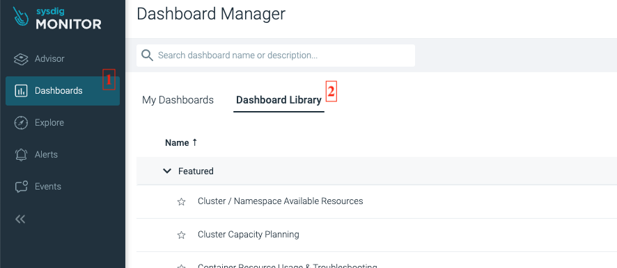
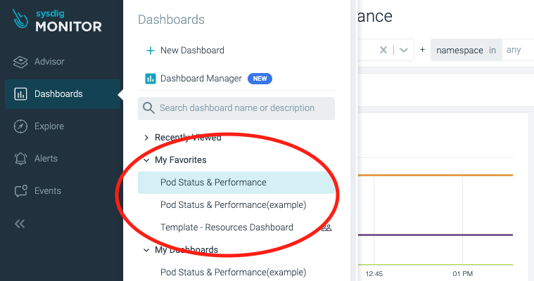

# Guidelines for SLI and monitoring setup
Last updated: **April 17, 2024**

## SLI (Service Level Indicator)
**Definition**: SLIs are specific, measurable metrics that reflect the performance of a service. Common examples include request latency, availability, error rate, and system throughput. The purpose of SLIs provide the quantitative data needed to evaluate the performance of a service.

**Performance Monitoring Tools:**  You can use tools like Prometheus, Grafana to continuously watch and display system performance metrics, including response times

**Logging**: Make sure that the Application system records the time it takes for each data retrieval request. Periodically analyze these logs or use log aggregation tools like the ELK Stack (Kibana, Logstash, etc.) to gain insights

**Threshold Alerts**: Create alerts to inform system administrators or engineers when response times exceed the defined threshold

Sysdig and Uptime.com is a good starting point to gather SLI metrics and establish alerts.

## Resources monitoring with Sysdig (Saturation)
Saturation provides a broad perspective on how the system is being used. It helps us understand how much more capacity the service can handle and when it's operating at its maximum capacity. Since many systems start deteriorating before reaching 100% utilization, we must also establish a reference point for an "ideal" utilization percentage. What level of saturation guarantees optimal service performance and availability for users?

We keep monitoring on resources such as CPU, RAM, and storage to monitor system performance.

## Using PromQL
The Prometheus Query Language (PromQL) is the standard for querying Prometheus metric data. PromQL is designed to allow the user to select and aggregate time-series data. And building a dashboard in Sysdig is heavily reliant on PromQL. The PromQL language is documented at [Prometheus Query Basics](https://prometheus.io/docs/prometheus/latest/querying/basics/). To start monitoring with Sysdig, please read [this documentation.](../app-monitoring/sysdig-monitor-setup-team.md)


## CPU:
Get application CPU usage by using:
```
avg(avg_over_time(sysdig_container_cpu_cores_used{$__scope,kube_pod_label_app= "<YOUR_APP_LABEL_NAME>", kube_statefulset_label_app = '<YOUR_APP_LABEL_NAME>'}[$__interval]))
```
Get application requested CPU  by using:
```
avg(avg_over_time(kube_pod_sysdig_resource_requests_cpu_cores{$__scope, kube_pod_label_app= "<YOUR_APP_LABEL_NAME>", kube_statefulset_label_app = '<YOUR_APP_LABEL_NAME>'}[$__interval]))
```


We can learn how many resources the application is using vs how much it requested, and get resource utilization based on that. CPU Used vs Requested(Utilization) where it the percentage between `sysdig_container_cpu_cores_used` and `kube_pod_sysdig_resource_requests_cpu_cores`. 


```
sum(last_over_time(sysdig_container_cpu_cores_used{kube_cluster_name=~$Cluster,kube_namespace_name=~$Namespace, kube_deployment_label_app = "<YOUR_APP_LABEL_NAME>"}[$__interval])) / (sum(last_over_time(kube_pod_sysdig_resource_requests_cpu_cores{kube_cluster_name=~$Cluster,kube_namespace_name=~$Namespace, kube_deployment_label_app = "<YOUR_APP_LABEL_NAME>"}[$__interval])) ) * 100
```

CPU Used vs Limited (Threshold) where is the percentage between `sysdig_container_cpu_cores_used` and `kube_pod_sysdig_resource_limits_cpu_cores`. We can learn how much more resources are available for the application
```
sum(last_over_time(sysdig_container_cpu_cores_used{kube_cluster_name=~$Cluster,kube_namespace_name=~$Namespace}[$__interval])) / (sum(last_over_time(kube_pod_sysdig_resource_limits_cpu_cores{kube_cluster_name=~$Cluster,kube_namespace_name=~$Namespace}[$__interval])) ) * 100
```

Regarding Utilization, our goal is to maximize it as much as possible. However, achieving a consistent level of 80% or higher isn't always feasible. We'll make our best efforts to achieve this target while ensuring that the application meets other SLOs.

As for handling namespace limitations, we can establish an alert system. When utilization reaches 80%, it will send a notification via RocketChat, indicating the need to allocate additional resources since it's nearing capacity. We can then either allocate more resources or implement a horizontal auto-scaling approach based on the specific circumstances.

```
sum(last_over_time(sysdig_container_cpu_cores_used{kube_cluster_name=~"silver",kube_namespace_name=~"platform-registry-prod"}[10s])) / (sum(last_over_time(kube_pod_sysdig_resource_limits_cpu_cores{kube_cluster_name=~"silver",kube_namespace_name=~"platform-registry-prod"}[10s])) ) > 0.8
```

## Memory
Similar to CPU, RAM monitoring will also focus on Limitations and Utilization.

Application Memory Usage can be get by query:
```
avg(avg_over_time(sysdig_container_memory_used_bytes{$__scope, kube_pod_label_app= "<YOUR_APP_LABEL_NAME>", kube_statefulset_label_app = '<YOUR_APP_LABEL_NAME>'}[$__interval]))
```

Application requested Memory can be retrieved by query: 

```
avg(avg_over_time(kube_pod_sysdig_resource_requests_memory_bytes{$__scope, kube_pod_label_app= "<YOUR_APP_LABEL_NAME>", kube_statefulset_label_app = '<YOUR_APP_LABEL_NAME>'}[$__interval]))
```
Utilization will be calculated by the `sysdig_container_memory_used_bytes`/`kube_resourcequota_sysdig_requests_memory_used`, to achieve 80% or above is still desired.
```
sum(last_over_time(sysdig_container_memory_used_bytes{kube_cluster_name=~$Cluster,kube_namespace_name=~$Namespace, kube_pod_label_app= "<YOUR_APP_LABEL_NAME>", kube_statefulset_label_app = '<YOUR_APP_LABEL_NAME>'}[$__interval])) / (sum(last_over_time(kube_pod_sysdig_resource_limits_memory_bytes{kube_cluster_name=~$Cluster,kube_namespace_name=~$Namespace, kube_pod_label_app= "<YOUR_APP_LABEL_NAME>", kube_statefulset_label_app = '<YOUR_APP_LABEL_NAME>'}[$__interval]))) * 100
```

The threshold for  namespace will be the ration between `sysdig_container_memory_used_bytes` and `kube_pod_sysdig_resource_limits_memory_bytes`

```
sum(last_over_time(sysdig_container_memory_used_bytes{kube_cluster_name=~$Cluster,kube_namespace_name=~$Namespace}[$__interval])) / (sum(last_over_time(kube_pod_sysdig_resource_limits_memory_bytes{kube_cluster_name=~$Cluster,kube_namespace_name=~$Namespace}[$__interval]))) * 100
```

## Latency
Many services consider request latency, which measures the time taken to respond to a request, as a critical SLI. Other commonly used SLIs include error rate, expressed as a fraction of all incoming requests, and system throughput, typically measured in requests per second. These measurements are often aggregated, meaning raw data is collected over a measurement window and then transformed into rates, averages, or percentiles.

It's important to establish a standard for acceptable latency rates. Monitoring latency of successful requests compared to failed ones helps assess system health. Monitoring latency across the system assists in identifying underperforming services and enables teams to detect incidents promptly. Analyzing latency in error cases expedites incident identification, allowing swift responses.

In an ideal scenario, the SLI should directly measure the service level we're interested in. However, sometimes obtaining or interpreting the desired metric directly can be challenging. For example, while client-side latency is a user-focused metric, we may only have the capability to measure latency at the server. Therefore, the time it takes to handle requests becomes the relevant metric for us. We can easily obtain this value by retrieving the **maximum value** of `sysdig_connection_net_request_time`, which represents the average time to serve a network request.

We can then establish an alert system based on our SLI and SLO. Typically, the `lower bound` should be less than or equal to the SLI, which in turn should be less than or equal to the `upper bound`.

For instance, if our goal is to ensure that our response time remains under 3 seconds as our SLO upper limit, we will set our `sysdig_connection_net_request_time` SLO for any request taking longer than 5 seconds to be serviced. This will trigger a notification, prompting us to take action, such as increasing resources or refining algorithms.

Here's an example query for network Latency(Note that be able to use this query, you have to let your application export metrics by [using custom metrics](../app-monitoring/sysdig-monitor-set-up-advanced-functions.md):
```
sum(rate(http_request_duration_seconds_bucket{le="0.3"}[5m])) by (kube_pod_name)
/
sum(rate(http_request_duration_seconds_count[5m])) by (kube_pod_name) * 100 

1. **`sum(rate(http_request_duration_seconds_bucket{le="0.3"}[5m])) by (kube_pod_name)`**:

- This part of the query calculates the per-second rate of change of the `http_request_duration_seconds_bucket` metric over a 5-minute window for each pod (`kube_pod_name`), where the bucket label `le` (less than or equal) is set to `"0.3"`. This essentially counts the number of HTTP requests that have a duration less than or equal to 0.3 seconds.

- The `sum` function aggregates these rates for each pod, grouping them by the `kube_pod_name`.

2. **`sum(rate(http_request_duration_seconds_count[5m])) by (kube_pod_name)`**:

- This part of the query calculates the per-second rate of change of the `http_request_duration_seconds_count` metric over a 5-minute window for each pod (`kube_pod_name`).

- The `sum` function aggregates these rates for each pod, grouping them by the `kube_pod_name`.

3. **`* 100`**:

- This part multiplies the result of the numerator by 100. This is done to convert the resulting ratio into a percentage

In summary, this PromQL query calculates the percentage of HTTP requests that have a duration less than or equal to 0.3 seconds, per pod, relative to the total number of HTTP requests made by each pod, over a 5-minute period. 
```

## Traffic monitoring
Adding metrics or metric labels that allow dashboards to break down served traffic by status code is a good idea (unless the metrics your service uses for SLI purposes already include this information). Here are some recommendations:

- For HTTP traffic, monitor all response codes, even if they don’t provide enough signal for alerting, because some can be triggered by incorrect client behavior
- If you apply rate limits or quota limits to your users, monitor aggregates of how many requests were denied due to lack of quota

Therefore, we will build our monitoring on:
* Number of HTTP requests:
```
Using sysdig_connection_net_request_count to monitor The total number of network requests per second. Note, this value may exceed the sum of inbound and outbound requests because this count includes requests over internal connections. So you might want to select explicitly your application API pod with the label.
```
* Number of sessions: 
```
Using sysdig_connection_net_connection_total_count to monitor the avg/max open session for the application
```
* Transactions speed:
```
Using sysdig_connection_net_total_bytes to monitor the upload and download speed of the application.
```
## Errors:

Monitoring error rates throughout the entire system, including individual services, is essential. Whether these errors result from manually defined logic or explicit issues like failed HTTP requests, detecting them early enables us to improve our SLO compliance and minimize application downtime.

The rate of **failed requests** is very important, The number of errors encountered by network system calls, such as connect(), send(), and recv() at a specified time by using:
```
sum(rate(sysdig_container_net_http_error_count))
```
When observing a high number of errors, it's important to anticipate the possibility of a logic bug or API/DB connection issue. We aim to achieve a 99.95% availability rate, so if the error rate reaches 5%, Sysdig will need to issue notifications.

It's also crucial to determine which errors are critical and which pose fewer risks. This helps teams evaluate the actual health of the service from a customer's perspective and enables prompt action to address recurring errors.

## Importance of monitoring and alerting in SRE
Site Reliability Engineering (SRE) emphasizes the importance of preserving and enhancing the dependability, availability, and performance of applications and systems. A pivotal element within this practice is monitoring and alerting.

**Monitoring and alerting**

Monitoring provides a real-time view of a system's health and performance. By continuously observing system metrics and logs, we gain insights into how the system responds to different conditions and workloads. This data is incredibly valuable, not only for spotting issues but also for proactive performance improvement and capacity planning.

Alerting, on the other hand, serves as the mechanism that notifies the relevant parties when something goes wrong. Effective alerting ensures that potential problems are flagged and addressed promptly, often before users even notice. In the world of SRE, quick response times can mean the difference between a minor glitch and a major outage.

Together, monitoring and alerting create a feedback loop that enables teams to maintain high service levels and meet their Service Level Objectives (SLOs). As we delve deeper into tools like "Uptime.com" and concepts like "Runbook," it's crucial to remember the foundational role that monitoring and alerting play in guaranteeing the reliability and resilience of our systems.

## Sysdig dashboard
One approach recommended to start with is leveraging what someone has already built. Utilizing dashboard templates pre-built by the Sysdig dashboard team is a great option. And here is a [video demonstrating how to set it up](https://youtu.be/K4rkSCSq3C4?si=cIEqZPnKbgAjwzWE). 




In the dashboard library, you can find dashboards tailored for different purposes. If you wish to edit a dashboard, select it, then click on the __Copy to My Dashboards__ button at the top right to make it your own and modify the queries as needed. If you find a particular dashboard useful, you can click on the __Star__ button in the top right corner. This will save it to your favorites, allowing you to access it quickly in the future.



## Uptime.com

### Uptime.com: A brief overview

[Uptime.com](https://www.uptime.com/) is a comprehensive website monitoring platform. It provides real-time insights into your website's availability, performance, and functionality. By continuously checking websites from multiple locations around the globe, Uptime.com ensures that end-users have the best possible experience.

Key features of Uptime.com include:

- **Availability monitoring**: Checks if your site is accessible and notifies you immediately if it detects any downtime
- **Performance monitoring**: Measures site speed, helping identify bottlenecks that could impact user experience
- **Domain health check**: Monitors SSL certificates, domain expirations, and more to ensure the health and security of your domain
- **Transactional tests**: Simulates user paths and interactions on your site, ensuring critical processes like logins or shopping cart checkouts work flawlessly

By integrating tools like Uptime.com into the SRE toolkit, teams can proactively address issues, ensuring optimal user experience and meeting established Service Level Objectives (SLOs).

We can set up a transactional test for the registry. This test continually loads the dashboard page to ensure all components are successfully loaded. Uptime.com provides insights into the uptime and downtime of your application and can display the percentage of uptime over a specified period. Additionally, it can send out notifications, enabling us to respond promptly.

## Runbook
Let's say we aim for 99.5% uptime for an application, measured daily. This means we have a daily allowance of just 7 minutes and 12 seconds for downtime. This is where RunBooks become invaluable. In SRE, the objective is to automate as many processes as possible.

A runbook is a set of standardized written procedures for maintaining and troubleshooting systems, services, or software. Essentially, it's a practical guide for operational tasks and handling unexpected incidents or common problems. The primary purpose of a runbook is to provide clear, concise, and easily followed procedures to ensure that systems operate smoothly and can be rapidly repaired in case of failure. It helps in reducing downtime by providing step-by-step instructions on how to handle specific situations, thereby making the resolution process faster and more efficient.

### Runbook for Incident Response

What actions might an SRE carry out during an outage? Here's a typical sequence:

1. Trigger
2. Troubleshooting
3. Root cause analysis
4. Fix

Runbooks can include embedded logic, such as if-else statements and loops, as well as other functionalities beyond being a mere list of actions. For example, they can incorporate features like waiting for a resource. Essentially, a Runbook offers instructions on the steps to be taken or the processes for an automated system to follow when an SLO is breached. This ensures that we adhere to our SLA and avoid violations. Runbook tools can track the execution of tasks and generate reports on their success, issues encountered, and deviations from the planned process.

For a simple example: 

- When there are a few requests to the database that fail or timeout:
  - Execute a command in our backup-container to save the current data in our database.
  - Allocate more resources to the primary service.

- When the dashboard load time nears our SLO:
  - Scale up and terminate the old pod.
  - Notify the development team to assess the network status.

For more insights on automation runbooks, refer to this [source in Xenonstack](https://www.xenonstack.com/insights/automation-runbook-for-sre).
There are a lot options for Runbook tools available out there for example: [runwhen](https://www.runwhen.com/) 

**Quick recap**:

1. **Monitoring**: It's not just about observation; it's our initial defense against issues. The sooner we notice something, the faster we can address it and the less impact it causes
2. **Alerts**: When things go awry, receiving an early alert makes a significant difference. This is where tools like Uptime.com come into play
3. **Tools and techniques**: Speaking of tools, they're not just fancy additions. They're crucial components that help us complete our tasks effectively