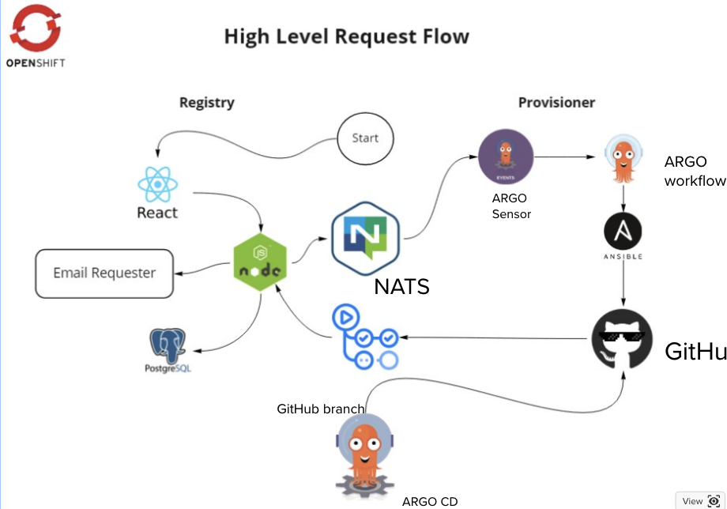

# SRE guideline for platform shared services
Last updated: **September 26, 2023**

SRE, or Site Reliability Engineering, plays a crucial role in making sure an application runs smoothly by rapidly restoring the system to its normal state. We can use software to see exactly how healthy an application or system is and fix any problems before they affect stakeholders

In this document, we'll look at the fundamental idea behind SRE and show you how to use it with the Registry application as an example.

## On this page

- [SRE guideline for platform shared services](#sre-guideline-for-platform-shared-services)
  - [On this page](#on-this-page)
  - [BC Platform Services Product Registry](#bc-platform-services-product-registry)
  - [Setting up SRE](#setting-up-sre)
  - [Importance of Defining a Period for SRE Measurement](#importance-of-defining-a-period-for-sre-measurement)
  - [Service Level Indicators (SLIs)](#service-level-indicators-slis)
  - [Service Level Agreement (SLA)](#service-level-agreement-sla)
  - [Service Level Objective (SLO)](#service-level-objective-slo)
  - [Connections and Differences](#connections-and-differences)
  - [How to Calculate Error Budget](#how-to-calculate-error-budget)
  - [Conclusion](#conclusion)
  - [Related pages](#related-pages)

---

## BC Platform Services Product Registry
The registry is an application that lets teams ask for namespaces in OpenShift 4 (OCP4) clusters. Here's what you can do with the registry:

- Allowing teams to request the creation of new project namespaces in specific clusters
- Enabling teams to update project contact information, manage resource quotas, and handle other metadata
- Facilitating the request for access to various resources, including ACS, Vault, and Artifactory repositories
- Allowing both the platform services team and AG to manage and supervise project sets.

The technology stack for the registry comprises a React front-end, a Node.js backend, a MongoDB database, and an automation tool named "Provisioner."
<br>
<br>
 

## Setting up SRE
SRE involves deploying, configuring, and monitoring the app. It also includes ensuring services in production are available, managing latency, handling changes, responding to emergencies, and managing capacity of services in production. To ensure optimal performance and reliability, we employ various tools and methodologies that adhere to SRE principles.

## Importance of Defining a Period for SRE Measurement

Choosing a specific period for measuring Service Level Agreements (SLAs), such as a continuous 30-day window, is crucial for several reasons, and it's a popular choice among service providers:

- **Consistency and Comparability**: A fixed measurement period like 30 days ensures consistency and allows for comparability of service performance over time. This helps in identifying trends and making informed decisions regarding service improvements or adjustments.

- **Accountability and Fair Assessment**: Establishing a predefined time frame for SLA evaluation holds service providers accountable and ensures a fair assessment by avoiding bias towards selecting periods based on performance anomalies. The 30-day window is particularly popular because it provides a sufficient timeframe to buffer short-term issues, offering a realistic overview of service quality.

- **Customer Satisfaction and Planning**: Clearly defined SLA periods enhance customer trust by setting transparent criteria for service evaluation. The 30-day period is favored because it strikes a balance between being long enough to account for variability and short enough to remain relevant for business operations.

- **Industry Standard**: The 30-day window has become an industry standard due to its practical balance between providing meaningful data and allowing timely reactions to service deficiencies. It's widely adopted because it aligns well with monthly business cycles and billing periods, facilitating easier tracking and management.

This structured approach to SLA measurement benefits both service providers and customers by establishing a clear, objective, and agreed-upon framework for assessing service delivery, with the 30-day period providing a practical and widely accepted standard.

## Service Level Indicators (SLIs)

SLIs are specific, measurable metrics that reflect the performance of a service. Common examples include request latency, availability, error rate, and system throughput. Purpose of SLI is tha its  provide the quantitative data needed to evaluate the performance of a service.SLI golden signals consist of request latency, availability, error rate, and system throughput. These metrics establish the criteria for determining the system's "health." It's essential to grasp the connection and difference between SLIs, SLOs, and SLAs.

There are multiple ways to measure an SLI, and each method has its own strengths and limitations. These methods are often called SLI Implementations. To illustrate, let's take the example of page-loading time as an SLI. This SLI can be put into practice using various approaches, including:

* Utilizing the latency field within the request log of the application server
* Making use of metrics that the application server directly provides
* Extracting metrics from a load balancer positioned in front of the application servers
* Implementing a black-box monitoring service that assesses how long it takes for our system to respond
* Incorporating code in the user's web browser to report how quickly the page loaded for them..

The registry has the following monitoring standards built based on those four aspects.

**1.Dashboard Load Time for Normal Users:**
  * **SLI**: The registry will accurately and promptly retrieve 99.8% of product entries
  * **Reason**: Accurate data is crucial for both users and systems that depend on the registry. Maintaining the highest level of data accuracy minimizes errors and fosters trust in the system

**2.Response Time for Data Retrieval::**
  * **SLI**: The registry will complete 99.5% of data retrieval requests in less than 500 milliseconds
  * **Reason**: Users expect a quick response when querying the registry. Swift data retrieval ensures user satisfaction and efficient downstream operations


**3.Dashboard Load Time for Normal Users:**
  * **SLI**: The registry will successfully process 98% of approved product provisioning requests without errors
  * **Reason**: Users rely on the system to seamlessly provision products. A high success rate ensures the reliability of the registry's provisioning functionality

And so on. 

To read more about SLI monitoring setup and available tools in here. 

## Service Level Agreement (SLA)
The customer should always be at the center of every aspect of your customer agreement. Even though an incident might involve addressing ten different issues on the back end, from the client's perspective, what truly matters is that the system operates as expected. Your SLAs and SLOs should reflect this reality. It's important to confine your commitments to high-level, user-facing functions and always use straightforward language in SLAs.

Based on these principles, we can establish some SLAs for the Registry:

* Normal users should be able to load the Registry dashboard successfully within 5 seconds.
* Admin users should be able to load the Registry dashboard successfully within 13 seconds.
* Approved product requests should be provisioned within an hour.
* The application should be available online 99% of the time.
* Updates to product requests should be processed within an hour.

## Service Level Objective (SLO) 
SLOs are targets for SLI performance that define what level of service is acceptable. For example, an SLO might specify that request latency should be below 100 milliseconds for 95% of requests. In short, SLOs set clear performance goals, helping organizations balance quality and operational costs. SLO is a specified target value or a range of values for a service level that gets measured through an SLI. Google offers a [valuable workbook](https://sre.google/workbook/implementing-slos/#:~:text=For%20example%2C%20if%20you%20have,50%25%20of%20the%20error%20budget.) written by Steven Thurgood, David Ferguson with Alex Hidalgo and Betsy Beyer to assist you in implementing SLOs. Towards the end of this document, we will also delve into calculating the Error Budget in more detail.

Determining what you want to assure your customers is all about deciding how dependable you want your service to be based on your customers' expectations. For instance, if your SLA specifies that customers should receive a response to their requests within 300 milliseconds, your SLO might set a goal for response times to be within 200 milliseconds. Choosing the right SLO can be a challenge.

Once we establish an SLA that we know will keep our users satisfied, the SLO becomes the minimum commitment we make. As a result, it's in our best interest to identify and address any issues before they breach our SLA, allowing us time to fix them. Breaking this commitment often carries consequences.

## Connections and Differences
- **Connection**: SLIs provide the data to measure SLOs. SLOs define the targets that form the basis of SLAs.
- **Difference**: SLIs are data-focused and used internally, SLOs are internal targets that guide service performance, and SLAs are external contracts that formalize service expectations and penalties.


Once again, I'll use the Registry as an example, and we'll consider a continuous 30 day window periods:
* The retrieval of all product information on the dashboard should take less than 5 seconds
* Retrieving information for 30 products on the dashboard should take less than 2 seconds
* Web, API, and DB services should be operational 99.5% of the time
* The database should have a backup created every 30 minutes
* Automation jobs for OCP Project Set change requests should be completed within 40 minutes

In case we need to disrupt these objectives or schedule maintenance windows, we must communicate the reasons for doing so in the [#internal-devops-registry](https://chat.developer.gov.bc.ca/group/internal-devops-registry) channel.

**The frequency of backups** such as every 30 minutes, directly links to a system's Recovery Point Objective (RPO), which serves as a critical metric in disaster recovery and business continuity planning. RPO establishes the maximum allowable data loss, measured in time. It addresses the question: "How much data can we lose before it starts affecting our business operations?" The reason for configuring it at a 30-minute interval is due to the unique nature of the Registry app. The Registry typically "backs up" most of its crucial data in GitHub repositories, and the provisioner usually processes each request in less than 30 minutes.

**Why is this Important?**
Choosing the right RPO is vital for business continuity planning. Here's why:

* **With a 30-minute RPO**: In case of data loss, the team can recover data up to the moment of the last backup, which is a maximum of 30 minutes before the incident.
* **Without a defined RPO (or with infrequent backups)**: Without a clear RPO or with backups done infrequently, there's a substantial risk of losing a significant amount of data. This loss could lead to severe consequences for the business, ranging from financial setbacks to damage to its reputation.

Having a backup created every 30 minutes corresponds to an RPO of 30 minutes. This is a good fit for systems where a maximum of 30 minutes of data loss can be tolerated in the event of a disaster. The decision about the appropriate RPO (and, by extension, backup frequency) should be grounded in business requirements and the potential consequences of data loss.


## How to Calculate Error Budget
**Calculate the Error Budget:**
```
Error Budget=1−SLO
```
For the example above where the SLO is 95%, the error budget would be:
```
Error Budget=1−0.95=0.05 or 5%
```
This calculation indicates that the service can be "unreliable" or "down" for 5% of the designated time period without violating the SLO.

**Setting the Calculation Time Window:**
It is also essential to define the length of the calculation time window when determining the error budget. This time window could be monthly, quarterly, or annually depending on your operational requirements and the nature of the service. The error budget applies to this specific period. For example, if you set a monthly error budget, you calculate downtime allowance as 5% of the total minutes in a month.

Monthly Calculation Example:
```
Total minutes in a month = 43,800 minutes (assuming 30 days per month)
Allowed downtime = 5% of 43,800 = 2,190 minutes per month
```

This structured approach ensures you have a clear understanding of how much downtime is permissible within your established time frame, allowing for effective monitoring and management of service reliability. For more infomation, I highly recommend reading this [documentation](https://www.atlassian.com/incident-management/kpis/error-budget).

## Conclusion
In this document, we've covered several essential aspects of Site Reliability Engineering (SRE). From delving into monitoring in detail to implementing tools like Uptime.com. our focus is on ensuring the continuous and smooth operation of our systems.


**Moving forward**:
1. **Explore the Tools**: If you haven't already, get hands-on experience with the tools we discussed. This will give you a better understanding of how they fit into the bigger picture.
2. **Share Feedback**: If you try something out and it works (or doesn't), please share your experience on Rocketchat. We can work together to figure it out. The more we exchange knowledge, the better we become.
Stay Informed: SRE is a rapidly evolving field. Keep an eye out for updates, new tools, and innovative techniques.
1. **Collaborate**: Do you have questions or find yourself stuck? Reach out for assistance. Often, two minds are better than one.

---
---

## Related pages

- [Monitoring and Alerting](https://docs.developer.gov.bc.ca/maintain-an-application/#monitoring-and-alerting)
- [Set up advanced metrics in Sysdig Monitor](https://docs.developer.gov.bc.ca/sysdig-monitor-set-up-advanced-functions/)
- [Sysdig - Use Service Discovery to import application metrics endpoints](https://docs.developer.gov.bc.ca/sysdig-monitor-set-up-advanced-functions/#use-service-discovery-to-import-application-metrics-endpoints)
