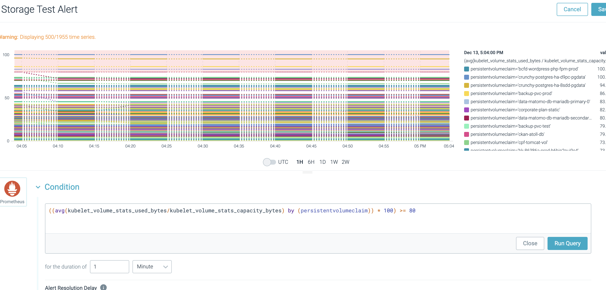

# Create alerts and notifications in Sysdig Monitor
Last updated: **May 31, 2023**

You can create alerts based on monitoring dashboards in Sysdig Monitor, that notify your team when something needs attention.

Here are some steps on how to setup the Sysdig alerts with [Rocket.Chat](https://chat.developer.gov.bc.ca/).

## On this page
- [Create alerts and notifications in Sysdig Monitor](#create-alerts-and-notifications-in-sysdig-monitor)
- [Create a Rocket.Chat chat channel and  webhook for alert messages](#create-a-rocketchat-chat-channel-and--webhook-for-alert-messages)
- [Create a Sysdig team notification channel](#create-a-sysdig-team-notification-channel)
- [Creating an Alert](#creating-an-alert)
- [Related pages](#related-pages)

<!-- ### End of On this page -->

## Create a Rocket.Chat chat channel and  webhook for alert messages

Rocket.Chat requires an incoming webhook to parse the data from Sysdig.

1.  Create a RC chat channel for the alert messages to arrive if there isn't one

2. Create an incoming webhook to the chat channel:
  -  Click on your avatar -> Administration -> Integrations -> New (from Incoming tab)

  - Name the webhook in the format of `sysdig-alert-webhook-<APP_TEAM_NAME>`


    This is how the webhook should look:
  


## Create a Sysdig team notification channel

Create a Sysdig team notification channel:

1. In Sysdig Monitor, go to your user account and click `Settings`

2. Click `Notification Channels` and `Add Notification Channel`. Choose `Custom Webhook` as the type
   
3. Use the webhook URL generated from Rocket.Chat and configure the notification channel. Name the channel in the format of `Rocketchat-alert-channel-<APP_TEAM_NAME>`

4. Attach the following script into Editor, **NOTE** This is just an example, please update accordingly based on your use case:
```
{
        "text": "Sysdig Notification",
        "attachments": [{
          "title": " {{@event_title}}",
          "title_link": "{{@alert_url}}",
          "pretext": " {{@alert_description}}",
          "color": "#f93b10",
           "fields": [
            {
              "title": "State",
              "short": true,
              "value": "{{@event_state}}"
            },
            {
              "title": "Alert level",
              "short": true,
              {{#if_severity_high}}
             	 "value": "incident"
               {{#else}}
               	"value": "warning"
               {{/if}}
            },
            {
              "title": "Condition",
              "short": false,
              "value": "{{@alert_warning_condition}}"
            },
            {
              "title": "Link to the Alert",
              "short": false,
              "value": "{{@alert_url}}"
            }
          ]
      }]
}
```

5. To test this notification, you have to pick one of the  **Select Alert Types** before you can **Send Test Notification**

6. After tested, Click `Save` and now you should be able to see this notification option available in alert

## Creating an Alert

It's recommended to create alerts from an application monitoring metrics, which helps to define good alerting thresholds.

1. Navigate to the `Alerts` section on the left hand navigation bar, you can see all the alerts within this Sysdig team scope

2.  To create an alert from metrics, head over to the dashboard. Pick the metric panel and click on `Create Alert` from kebab menu icon.

- The alert contains:

  - `Metric`: make sure if has the correct aggregation. **Note**: For PromQL based alerts, triggering threshold is defined as part of the metric query. See picture below!

  - `Scope`: the alert scope by default is set to `everywhere`, which means all namespaces from the cluster. Make sure you set the scope to your own namespaces if not specified. For example, you can use `kube_namespace_name` and `kube_cluster_name`.

  - `Trigger`: the triggering threshold should be based on the statistic from past monitoring. You can also refer to the data from `Preview` section on the right.

  - `Notify`: pick the Sysdig notification channel to send alert messages to.

  - Others: feel free to explore other features available for alerting!


<!-- ### Can you describe what the picture below is about? This would be helpful for visitors to understand the images below  -->




---
## Related pages:
- [Set up advanced functions in Sysdig Monitor](../app-monitoring/sysdig-monitor-set-up-advanced-functions.md)
- [Set up a team in Sysdig Monitor](../app-monitoring/sysdig-monitor-setup-team.md)

## Related resources:
- [Sysdig Monitor](https://docs.sysdig.com/en/sysdig-monitor.html)
- [Sysdig Monitor Dashboards](https://docs.sysdig.com/en/dashboards.html)
- [Sysdig Alerts](https://docs.sysdig.com/en/alerts.html)
- [Sysdig Alerts with Kubernetes and PromQL](https://sysdig.com/blog/alerting-kubernetes/)
- [Sysdig Teams Blog](https://sysdig.com/blog/introducing-sysdig-teams/)
- [Sysdig User Management Docs](https://docs.sysdig.com/en/manage-teams-and-roles.html)
- [Sysdig User Roles](https://docs.sysdig.com/en/user-and-team-administration.html)

---
