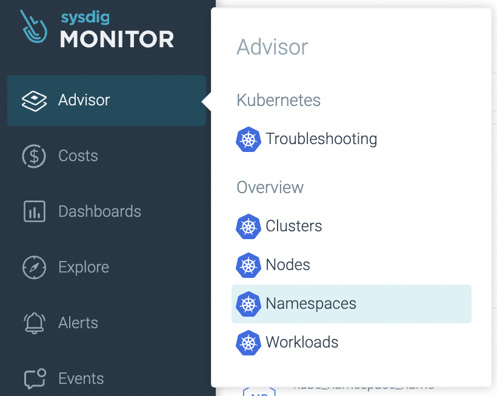

# Create monitoring dashboards in Sysdig Monitor
Last updated: **December 6, 2023**

After you  [create a sysdig-team](/sysdig-monitor-setup-team) and set up a dedicated space in Sysdig to monitor applications in your OpenShift Project Set, follow the steps in this guide to learn more about monitoring.

## On this page

- [Create monitoring dashboards in Sysdig Monitor](#create-monitoring-dashboards-in-sysdig-monitor)
- [Sysdig built-in monitoring dashboard templates](#sysdig-built-in-monitoring-dashboard-templates)
- [Create custom dashboard from templates](#create-custom-dashboard-from-templates)
- [Sysdig Advisor Namespace overview](#sysdig-advisor-namespace-overview)
- [Accessing Sysdig Advisor Namespace Overview](#accessing-sysdig-advisor-namespace-overview)
- [Recoverability of monitoring dashboards](#recoverability-of-monitoring-dashboards)
- [Related pages](#related-pages)

## Sysdig built-in monitoring dashboard templates

Building a dashboard from scratch can be tough, so we suggest starting with some dashboard templates and customizing from there. Sysdig offers various dashboard templates, which you can find in the 'Dashboards' section of the menu.

Here are some common ones to start with:

- `Pod Rightsizing & Workload Capacity Optimization` and `Template - Resource Allocation Dashboard`:Optimize your infrastructure by ensuring pods are sized correctly. Identify opportunities to free up resources by adjusting memory and/or CPU requests. This dashboard is especially useful if you're reaching resource quota limits in a namespace.
- `Pod/Workload Status & Performance`: Monitor the status, health, resource usage, and performance of applications (workloads or pods). Ideal for service monitoring using Golden Signals.
- `Application specific dashboards`: Access them in the Application section of the templates. Useful for obtaining metrics tailored to your tech stack.

Here's a quick [video](https://www.youtube.com/watch?v=K4rkSCSq3C4&list=PL9CV_8JBQHiorxwU-2nA8aqM4KTzdCnfg&index=24) on how this can be setup.

## Create custom dashboard from templates

You have the flexibility to create your own dashboards based on templates, adding custom filters to monitor specific namespaces, workloads, or groups of containers and processes. Follow these steps:

1. Choose the dashboard template you want to start with
2.  click on `Copy to My Dashboard` button on the top-right corner, give it a suitable name and save.
3. In your customized copy, configure the dashboard filter to focus on your monitoring target. Check out the example below:

    

If you're familiar with  [advanced PromQL queries](./sysdig-monitor-set-up-advanced-functions.md), you can integrate them into a dashboard. Simply follow these steps: 

1. Click on `Add Panel` from the top-right corner of the dashboard
2.  Fill in the metrics query in the panel configuration

## Sysdig Advisor Namespace overview

Explore the Namespace Overview feature in [Sysdig Advisor](https://docs.sysdig.com/en/docs/sysdig-monitor/advisor/overview/namespaces-data/) for a detailed assessment of resource utilization in your OpenShift namespaces. This feature provides a quick snapshot, enabling you to make informed decisions about resource allocation.Below is a guide on how to access and utilize this feature.

## Accessing Sysdig Advisor Namespace overview

In the Advisor section, locate and click on **'Namespace Overview.'** This action will direct you to a dedicated page where you can access detailed information about your namespaces:

   

This feature enhances the overall observability of your OpenShift environment, allowing for timely responses to resource-related challenges. Leverage the insights gained from the Namespace Overview to make informed decisions about resource allocation and optimization strategies.

## Recoverability of monitoring dashboards

Each dashboard is assigned to a user account on Sysdig for ownership. If the Sysdig user or team gets deleted either from the Sysdig console or the sysdig-team custom resource, all associated dashboards will also be deleted.

Retrieving deleted dashboards is not possible.  Therefore, it is strongly recommended to utilize the [Sysdig API](https://docs.sysdig.com/en/docs/developer-tools/sysdig-rest-api-conventions/) to maintain your custom dashboards as code manifests. In the event of missing dashboards, you can effortlessly recover them from the manifest.

---
## Related pages:
- [Set up a team in Sysdig Monitor](/sysdig-monitor-setup-team/)
- [Set up advanced functions in Sysdig Monitor](/sysdig-monitor-set-up-advanced-functions/)
- [Sysdig Monitor](https://docs.sysdig.com/en/sysdig-monitor.html)
- [Sysdig Monitor Dashboards](https://docs.sysdig.com/en/dashboards.html)

