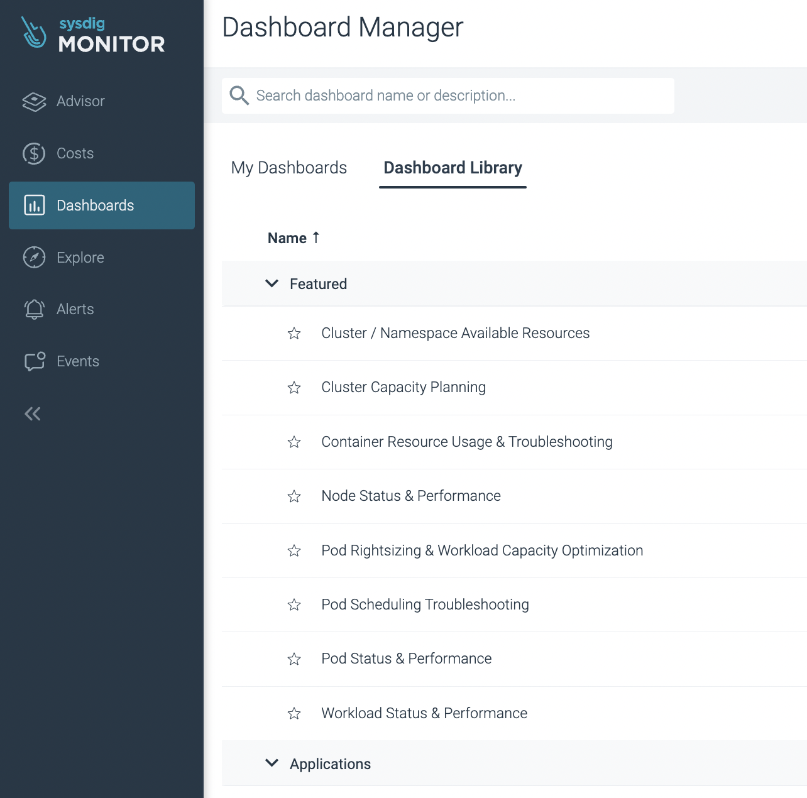

# Create monitoring dashboards in Sysdig Monitor
Last updated: **Aug 3, 2023**

From the previous topic, you have successfully created a `sysdig-team` that generated a dedicated space in Sysdig to monitor applications within your OpenShift Project Set. Now, let's get started with monitoring.

## On this page

- [Monitoring dashboard templates](#sysdig-built-in-monitoring-dashboard-templates)
- [Custom dashboard from templates](#create-custom-dashboard-from-templates)
- [Recoverability of monitoring dashboards](#recoverability-of-monitoring-dashboards)
- [Related pages](#related-pages)

## Sysdig built-in monitoring dashboard templates

It might be quite difficult to build a dashboard from scratch, so we recommend to start with some dashboard templates and build onto of that. Sysdig provides many dashboard templates, you can find them from `Dashboards` section from the menu.

Here are some common ones to start with:

- `Pod Rightsizing & Workload Capacity Optimization` and `Template - Resource Allocation Dashboard`: Optimize your infrastructure by ensure pods are sized correctly. Understand if you can free up resources by reducing memory and/or CPU requests. This dashboard is very helpful if you are running out of resource quota from a namespace!
- `Pod/Workload Status & Performance`: Understand the status of applications (workloads or pods) by monitoring status, health, resource usage and performance. Works great for service monitoring via Golden Signals.
- `Application specific dashboards`: You can find them from the Application section of the templates. They are helpful if you are looking for metrics dedicated to your tech stack.

## Create custom dashboard from templates

You can create your own dashboards based on the templates, then adding in custom filters to monitor specific namespaces, workloads, or group of containers and processes. Here are the steps:
- pick the dashboard template that you could like to start using.
- click on `Copy to My Dashboard` button on the top right corner, name it accordingly and save.
- on your own copy, you can configure the dashboard filter to narrow it down to the monitoring target. See example below:

If you use more [advanced PromQL queries](./sysdig-monitor-set-up-advanced-functions.md), you can also add them to a dashboard. To do so, click on `Add Panel` from the top right corner of the dashboard, and fill in the metrics query there.

## Recoverability of monitoring dashboards

Each dashboard is assigned to a user account on Sysdig for ownership. If the Sysdig user or team is deleted (whether from the Sysdig console or the `sysdig-team` custom resource), all of the dashboards will be deleted too. We do not have a way to retrieve deleted dashboards. Thus it is highly recommended to use the [Sysdig API](https://docs.sysdig.com/en/docs/developer-tools/sysdig-rest-api-conventions/) to keep your custom dashboards as code manifest. In the case of missing dashboards, you can then easily recover them from the manifest.

---
## Related pages:
- [Set up a team in Sysdig Monitor](/sysdig-monitor-setup-team/)
- [Set up advanced functions in Sysdig Monitor](/sysdig-monitor-set-up-advanced-functions/)

## Related resources:
- [Sysdig Monitor](https://docs.sysdig.com/en/sysdig-monitor.html)
- [Sysdig Monitor Dashboards](https://docs.sysdig.com/en/dashboards.html)

---
