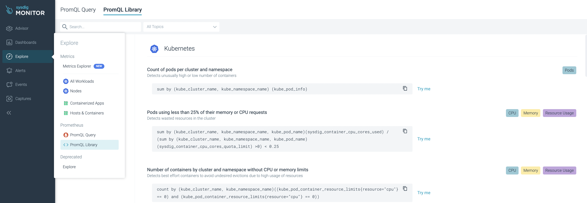
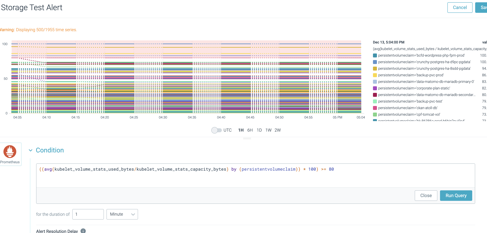

# Advanced Usage in Sysdig Monitor

## On this page
- [Use Service Discovery to import application metrics endpoints](#sysdig-service-discovery)
- [Create a PromQL based alert](#promql-alert)
- [Use Service Discovery to import application metrics endpoints](#sysdig-service-discovery)


## Creating PromQL metrics<a name="explore-promql"></a>
Sysdig scrapes Prometheus metrics, you can create custom queries using PromQL. Here is a great way to start exploring:




## Create a PromQL based alert<a name="promql-alert"></a>
PromQL can be used in Alerts as well. The following example shows an alert for the **Persistent Volume Utilization** when hitting 80% full. 

- If you'd like to get PVC-specific metrics, for example, get the max percentage of storage usage:

  `max(kubelet_volume_stats_used_bytes{agent_tag_cluster="gold",persistentvolumeclaim="<PVC_name>"}) / max(kubelet_volume_stats_capacity_bytes{agent_tag_cluster="gold",persistentvolumeclaim="<PVC_name>"}) * 100`

- Sample PromQL Query:

  `((avg(kubelet_volume_stats_used_bytes/kubelet_volume_stats_capacity_bytes) by (persistentvolumeclaim)) * 100) >= 80`




## Use Service Discovery to import application metrics endpoints<a name="sysdig-service-discovery"></a>

Sysdig has a lightweight Prometheus server (Promscrape) that can [import your application metrics endpoint into Sysdig metrics](https://docs.sysdig.com/en/docs/sysdig-monitor/integrations-for-sysdig-monitor/configure-monitoring-integrations/migrating-from-promscrape-v1-to-v2/#migrate-using-default-configuration).

To enable Promscrape to find your application metrics, do the following:
1. Make sure the application metrics endpoint is returning Prometheus metrics. To test this, you can expose the service and curl on the URL.
1. Add the following annotations to the application pods:
  ```yaml
  prometheus.io/scrape: true
  prometheus.io/port: <metrics_port>
  prometheus.io/path: <metrics_path>
  # the path is usually at /metrics
  ```
  Don't add the annotations to the pods directly. This should be part of the infrastructure code and added in the templates. For example, if the application is using an OpenShift deployment, the annotation should be added at `deployment.spec.template.metadata.annotations`.

3. Once the annotation is in place, Sysdig can scrape them. On the **Sysdig Explore** tab, look for the sysdig metrics there (Sysdig does relabeling of the metrics, so they will appear as native sysdig metrics now instead of coming from promQL Query)


---
Related links:
- [Set up a team in Sysdig Monitor](/sysdig-monitor-setup-team/)
- [Create alert channels in Sysdig Monitor](/sysdig-monitor-create-alert-channels/)
- [devops-sysdig RocketChat channel](https://chat.developer.gov.bc.ca/channel/devops-sysdig)
- [Migrate Using Default Configuration](https://docs.sysdig.com/en/docs/sysdig-monitor/integrations-for-sysdig-monitor/configure-monitoring-integrations/migrating-from-promscrape-v1-to-v2/#migrate-using-default-configuration)

Related resources:
- [Sysdig Monitor](https://docs.sysdig.com/en/sysdig-monitor.html)
- [Sysdig Monitor Dashboards](https://docs.sysdig.com/en/dashboards.html)
- [Sysdig Alerts](https://docs.sysdig.com/en/alerts.html)
- [Sysdig Alerts with Kubernetes and PromQL](https://sysdig.com/blog/alerting-kubernetes/)
- [Sysdig Teams Blog](https://sysdig.com/blog/introducing-sysdig-teams/)
- [Sysdig Teams Docs ](https://docs.sysdig.com/en/grouping,-scoping,-and-segmenting-metrics.html#al_UUID-c54169b7-c8f5-4990-6b63-dd2e25b96cce_UUID-3dc7a7aa-2549-23a2-94e2-cee57bdd538f)
- [Sysdig User Management Docs](https://docs.sysdig.com/en/manage-teams-and-roles.html)
- [Sysdig User Roles](https://docs.sysdig.com/en/user-and-team-administration.html)

Rewrite sources:
* https://developer.gov.bc.ca/Developer-Tools/OpenShift-User-Guide-to-Creating-and-Using-a-Sysdig-Team-for-Monitoring

---
