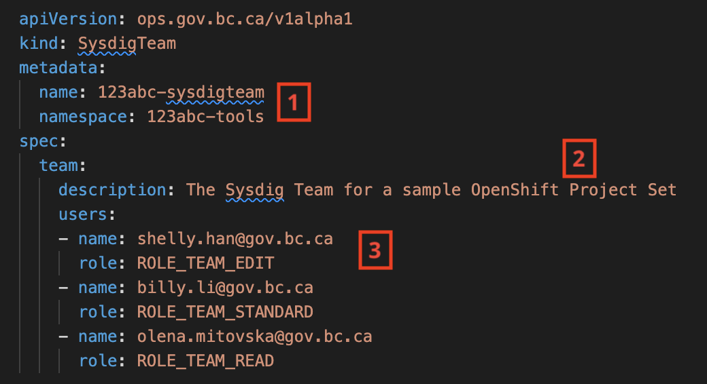
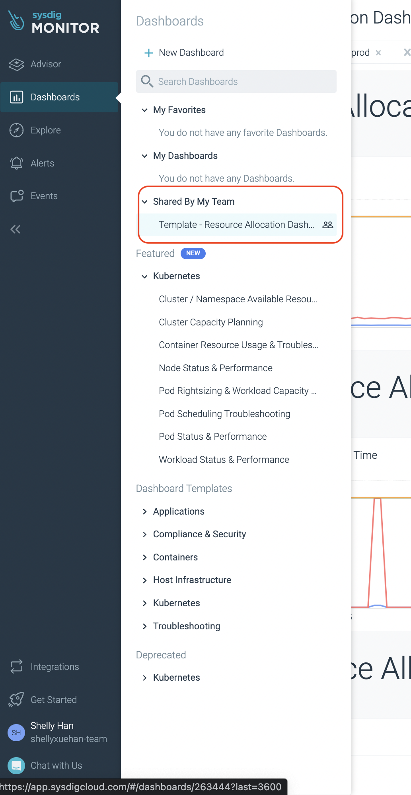

# Set up a team in Sysdig Monitor

[Sysdig Monitor](https://sysdig.com/products/monitor/) provides system-level monitoring of Kubernetes hosts and the ability to create custom dashboards, alerts, and operational-level captures to diagnose application or platform-level issues.

**Introduction: Why Monitoring Matters**

Effective monitoring and alerting are crucial components of maintaining a robust and reliable system. Monitoring allows your team to proactively identify potential issues before they impact your application, enabling timely responses and minimizing downtime. The platform services team strongly recommends that all teams implement the dashboards presented here as a minimum standard for ensuring the health and performance of their applications.

The Sysdig Teams Operator runs in the cluster and enables a team to create and manage access to a dedicated Sysdig Team account for BC Gov Private Cloud PaaS users. The team is scoped to the OpenShift namespaces that belong to the team. Sysdig also provides a default dashboard to identify system [resources, limits, and actual usage](/openshift-project-resource-quotas/).

For more information on Sysdig Monitor, see [Monitoring with Sysdig](%WORDPRESS_BASE_URL%/private-cloud/our-products-in-the-private-cloud-paas/monitoring-with-sysdig/).

## On this page
- [Set up a team in Sysdig Monitor](#set-up-a-team-in-sysdig-monitor)
  - [On this page](#on-this-page)
  - [Sign in to Sysdig](#sign-in-to-sysdig)
  - [Create Sysdig team access](#create-sysdig-team-access)
    - [Part 1 - Compose the sysdig-team object manifest](#part-1---compose-the-sysdig-team-object-manifest)
    - [Part 2 - Create the sysdig-team custom resource](#part-2---create-the-sysdig-team-custom-resource)
  - [Verify Sysdig team creation](#verify-sysdig-team-creation)
  - [Troubleshooting](#troubleshooting)

...


## Sign in to Sysdig
You and your team must sign in to Sysdig to create the user account. The B.C. government Sysdig uses OpenID Connect and requires either an IDIR account or a GitHub account.

- Go to the [BCDevOps Sysdig Monitor](https://app.sysdigcloud.com/api/oauth/openid/bcdevops).

  - Alternatively, you can also sign in on [the Sysdig site](https://app.sysdigcloud.com). Select OpenID and type `BCDevOps` as the company.

- Upon login, you will be presented with a default page. You may be directed to the **Catchall Team** which has access to no resources at the moment (the team resources and access will be created in later steps).

- At the bottom left corner of the default page, you can find the initial icon for your account and the email address associated with it.

  - **Note:** Sysdig identifies users by the email, so it's important to use the correct email address for yourself as well as your team members.


## Create Sysdig team access
The OpenShift Operator runs in the background and creates a Sysdig team RBAC and dashboard for you. The operator looks for a `sysdig-team` custom resource from your `*-tools` namespace. There are two parts of work to create Sysdig team access.


### Part 1 - Compose the sysdig-team object manifest

Below is a sample of the `sysdig-team` custom resource manifest.  We also provide a [custom resource manifest template file](./sysdig-team-sample.yaml) you can use. 




**Name and Namespace:**
The `sysdig-team` custom resource should be created in your OpenShift project set `tools` namespace. Name it using the license plate number for your project set to make sure it's unique.

**Team Description:**
Add a description for the sysdig team.

**Team Users:**
A list of users to be added to this team.

  - `User Name` - Sysdig identifies users by ***the email address***, so make sure everyone on your team logs in to Sysdig and obtains the correct email from their [Sysdig User Profile](https://app.sysdigcloud.com/#/settings/user).

  - `User Role` - These are the available roles to assign to different team members:

    - `ROLE_TEAM_EDIT (Advanced User)`: Read and write access to the components of the application available to the team. Can create, edit and delete dashboards, alerts or other content. Recommended for administrators and team members that need to create and manage dashboards.

    - `ROLE_TEAM_STANDARD (Standard User)`: Same as Advanced User but without access to the **Explore** page. Recommended for developers that need to refer to dashboards for resource tuning and service monitoring.

    - `ROLE_TEAM_READ (View-only User)`: This role has read-only access to the environment in the team scope. Recommended for project owners and team members from the business area.


### Part 2 - Create the sysdig-team custom resource

> **Note:**
> - Only apply role updates to the custom resource from `tools` namespace. Do not use the Sysdig Monitor UI to modify team access, because the operator reconciliation will overwrite any UI changes to team roles and settings.
> - If your project set is on Gold and GoldDR clusters, only create the `sysdig-team` custom resource in the Gold cluster. The Sysdig operator can create the dashboards for your applications across both clusters.
> - It's important to keep a single and unique `sysdig-team` custom resource per project set because you don't want to have duplicated teams on Sysdig. Please make sure to remove `sysdig-team` custom resource from dev, test and prod namespaces if they are created accidentally.

So now you have the `sysdig-team` manifest file ready, use `oc apply` and let the operator create the team on Sysdig.

```shell
# switch to the tools namespace
oc project <PROJECT_SET_LICENSE_PLATE>-tools
# edit the sample sysdig-team resource and apply the manifest
oc apply -f sysdig-team-sample.yaml
```

## Verify Sysdig team creation

Use `oc describe sysdig-team <PROJECT_SET_LICENSE_PLATE>-sysdigteam` to validate that the Sysdig team was created:

  ```shell
  Name:         101ed4-sysdigteam
  Namespace:    101ed4-tools
  Labels:       <none>
  API Version:  ops.gov.bc.ca/v1alpha1
  Kind:         SysdigTeam
  Metadata:
    Creation Timestamp:  2021-04-15T22:42:20Z
    ...
  Spec:
    Team:
      Description:  The Sysdig Team for the Platform Services Documize
      Users:
        Name:  example.1@gov.bc.ca
        Role:  ROLE_TEAM_MANAGER
        Name:  example.2@gmail.com
        Role:  ROLE_TEAM_EDIT
        ...
  Status:
    Conditions:
      Ansible Result:
        Changed:             0
        Completion:          2021-08-18T20:10:43.665524
        Failures:            0
        Ok:                  30
        Skipped:             13
      Last Transition Time:  2021-08-05T18:54:24Z
      Message:               Awaiting next reconciliation
      Reason:                Successful
      Status:                True
      Type:                  Running
  Events:                    <none>
  ```

You should expect to see the following from the `sysdig-team` outcome:
```shell
Message:               Awaiting next reconciliation
Reason:                Successful
```
**NOTE**: the custom resource kind is SysdigTeam, but when using the oc command, you need to use the hyphenated form `sysdig-teams`. For example, you will need to use `oc get sysdig-teams` to list all SysdigTeams exist in this namespace.


If both of these show, the `sysdig-team` custom resource is processed successfully. You can go back to Sysdig to see the new team scope and default dashboards.

To access them: 
- Log in to Sysdig like how you did just now.

- Navigate to the bottom left hand of the page to switch your team, which should be named as **[PROJECT_SET_LICENSE_PLATE]-team**.

- You may need to wait some time between the creation of the team and resources to display.



## Troubleshooting

- Error from `sysdig-team` custom resource: if you don't see `Awaiting next reconciliation` after waiting for 5 minutes, contact the Platform Services team on the [#devops-sysdig Rocket.Chat channel](https://chat.developer.gov.bc.ca/channel/devops-sysdig). Make sure to include the OpenShift cluster and namespace information.

- If you don't see the Sysdig team created, please double check that:
  -`sysdig-team` custom resource is created in `tools` namespace
  - There are no duplicated `sysdig-team` custom resources in dev/test/prod namespaces. Please run `oc -n <NAMESPACE> delete sysdig-team <SYSDIG-TEAM-NAME>` to delete the extra custom resource.
  - Your Sysdig account profile matches the email address that you have provided in the `sysdig-team` custom resource. If there is a mismatch, reapply the custom resource.

- If you don't see a default dashboard in your Sysdig team, contact the Platform Services team on the [#devops-sysdig Rocket.Chat channel](https://chat.developer.gov.bc.ca/channel/devops-sysdig).


---
Related links:
- [BCDevOps Sysdig Monitor Service](https://app.sysdigcloud.com/api/oauth/openid/bcdevops)
- [Set up advanced functions in Sysdig Monitor](/sysdig-monitor-set-up-advanced-functions/)
- [Create alert channels in Sysdig Monitor](/sysdig-monitor-create-alert-channels/)
- [Sysdig Monitor](https://sysdig.com/products/monitor/)
- [OpenShift project resource quotas](/openshift-project-resource-quotas/)
- [Sysdig API](https://docs.sysdig.com/en/docs/developer-tools/sysdig-rest-api-conventions/)
- [Monitoring with Sysdig](%WORDPRESS_BASE_URL%/private-cloud/our-products-in-the-private-cloud-paas/monitoring-with-sysdig/)
- [Sydig User Profile](https://app.sysdigcloud.com/#/settings/user)
- [devops-sysdig RocketChat channel](https://chat.developer.gov.bc.ca/channel/devops-sysdig)

Related resources:
- [Sysdig Monitor](https://docs.sysdig.com/en/sysdig-monitor.html)
- [Sysdig Monitor Dashboards](https://docs.sysdig.com/en/dashboards.html)
- [Sysdig Alerts](https://docs.sysdig.com/en/alerts.html)
- [Sysdig Alerts with Kubernetes and PromQL](https://sysdig.com/blog/alerting-kubernetes/)
- [Sysdig Teams Blog](https://sysdig.com/blog/introducing-sysdig-teams/)
- [Sysdig User Management Docs](https://docs.sysdig.com/en/manage-teams-and-roles.html)
- [Sysdig User Roles](https://docs.sysdig.com/en/user-and-team-administration.html)

---
