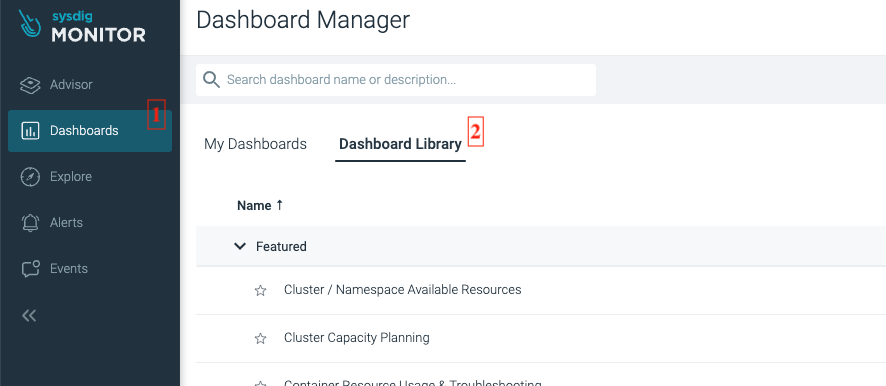

# SRE guideline for platform shared services
Last updated: **September 26, 2023**

SRE, or Site Reliability Engineering, plays a crucial role in making sure an application runs smoothly by rapidly restoring the system to its normal state. We can use software to see exactly how healthy an application or system is and fix any problems before they affect stakeholders

In this document, we'll look at the fundamental idea behind SRE and show you how to use it with the Registry application as an example.

## On this page

* [**B.C. Plaform Services Product Registry**](#bc-platform-services-product-registry)
* [**Setting up SRE**](#setting-up-sre)
* [**Service Level Agreement (SLA)**](#service-level-agreement-sla)
* [**Service Level Objective (SLO)**](#service-level-objective-slo)
* [**Service Level Indicators (SLIs)**](#service-level-indicators-slis)
* [**Resources monitoring with Sysdig (Saturation)**](#resources-monitoring-with-sysdig-saturation)
* [**Using PromQL**](#using-promql)
* [**CPU**](#cpu)
* [**Latency**](#latency)
* [**Traffic monitoring**](#traffic-monitoring)
* [**Errors**](#errors)
* [**Importance of Monitoring and Alerting in SRE**](#importance-of-monitoring-and-alerting-in-sre)
* [**Sysdig dashboard**](#sysdig-dashboard)
* [**Uptime.com**](#uptimecom)
* [**Runbook**](#runbook)
* [**How to calculate error budget**](#how-to-calculate-error-budget)
* [**Conclusion**](#conclusion)
* [**Related pages**](#related-pages)

---

## BC Platform Services Product Registry
The registry is an application that lets teams ask for namespaces in OpenShift 4 (OCP4) clusters. Here's what you can do with the registry:

- Allowing teams to request the creation of new project namespaces in specific clusters
- Enabling teams to update project contact information, manage resource quotas, and handle other metadata
- Facilitating the request for access to various resources, including ACS, Vault, and Artifactory repositories
- Allowing both the platform services team and AG to manage and supervise project sets.

The technology stack for the registry comprises a React front-end, a Node.js backend, a MongoDB database, and an automation tool named "Provisioner."
<br>
<br>
 

## Setting up SRE
SRE involves deploying, configuring, and monitoring the app. It also includes ensuring services in production are available, managing latency, handling changes, responding to emergencies, and managing capacity of services in production. To ensure optimal performance and reliability, we employ various tools and methodologies that adhere to SRE principles.

## Service Level Agreement (SLA)
The customer should always be at the center of every aspect of your customer agreement. Even though an incident might involve addressing ten different issues on the back end, from the client's perspective, what truly matters is that the system operates as expected. Your SLAs and SLOs should reflect this reality. It's important to confine your commitments to high-level, user-facing functions and always use straightforward language in SLAs.

Based on these principles, we can establish some SLAs for the Registry:

* Normal users should be able to load the Registry dashboard successfully within 5 seconds.
* Admin users should be able to load the Registry dashboard successfully within 13 seconds.
* Approved product requests should be provisioned within an hour.
* The application should be available online 99% of the time.
* Updates to product requests should be processed within an hour.

## Service Level Objective (SLO) 
The meaning of an SLO is a service level objective: it's a specified target value or a range of values for a service level that gets measured through an SLI. Google offers a [valuable workbook](https://sre.google/workbook/implementing-slos/#:~:text=For%20example%2C%20if%20you%20have,50%25%20of%20the%20error%20budget.) written by Steven Thurgood, David Ferguson with Alex Hidalgo and Betsy Beyer to assist you in implementing SLOs. Towards the end of this document, we will also delve into calculating the Error Budget in more detail.

Determining what you want to assure your customers is all about deciding how dependable you want your service to be based on your customers' expectations. For instance, if your SLA specifies that customers should receive a response to their requests within 300 milliseconds, your SLO might set a goal for response times to be within 200 milliseconds. Choosing the right SLO can be a challenge.

Once we establish an SLA that we know will keep our users satisfied, the SLO becomes the minimum commitment we make. As a result, it's in our best interest to identify and address any issues before they breach our SLA, allowing us time to fix them. Breaking this commitment often carries consequences.

Once again, I'll use the Registry as an example, and we'll consider monthly periods:

* The retrieval of all product information on the dashboard should take less than 5 seconds
* Retrieving information for 30 products on the dashboard should take less than 2 seconds
* Web, API, and DB services should be operational 99.5% of the time
* The database should have a backup created every 30 minutes
* Automation jobs for OCP Project Set change requests should be completed within 40 minutes

In case we need to disrupt these objectives or schedule maintenance windows, we must communicate the reasons for doing so in the [#internal-devops-registry](https://chat.developer.gov.bc.ca/group/internal-devops-registry) channel.

**The frequency of backups** such as every 30 minutes, directly links to a system's Recovery Point Objective (RPO), which serves as a critical metric in disaster recovery and business continuity planning. RPO establishes the maximum allowable data loss, measured in time. It addresses the question: "How much data can we lose before it starts affecting our business operations?" The reason for configuring it at a 30-minute interval is due to the unique nature of the Registry app. The Registry typically "backs up" most of its crucial data in GitHub repositories, and the provisioner usually processes each request in less than 30 minutes.

**Why is this Important?**
Choosing the right RPO is vital for business continuity planning. Here's why:

* **With a 30-minute RPO**: In case of data loss, the team can recover data up to the moment of the last backup, which is a maximum of 30 minutes before the incident.
* **Without a defined RPO (or with infrequent backups)**: Without a clear RPO or with backups done infrequently, there's a substantial risk of losing a significant amount of data. This loss could lead to severe consequences for the business, ranging from financial setbacks to damage to its reputation.

Having a backup created every 30 minutes corresponds to an RPO of 30 minutes. This is a good fit for systems where a maximum of 30 minutes of data loss can be tolerated in the event of a disaster. The decision about the appropriate RPO (and, by extension, backup frequency) should be grounded in business requirements and the potential consequences of data loss.

## Service Level Indicators (SLIs)

SLI golden signals consist of request latency, availability, error rate, and system throughput. These metrics establish the criteria for determining the system's "health." It's essential to grasp the connection and difference between SLIs, SLOs, and SLAs.

There are multiple ways to measure an SLI, and each method has its own strengths and limitations. These methods are often called SLI Implementations. To illustrate, let's take the example of page-loading time as an SLI. This SLI can be put into practice using various approaches, including:

* Utilizing the latency field within the request log of the application server
* Making use of metrics that the application server directly provides
* Extracting metrics from a load balancer positioned in front of the application servers
* Implementing a black-box monitoring service that assesses how long it takes for our system to respond
* Incorporating code in the user's web browser to report how quickly the page loaded for them..

The registry has the following monitoring standards built based on those four aspects.

**1.Dashboard Load Time for Normal Users:**
  * **SLI**: The registry will accurately and promptly retrieve 99.8% of product entries
  * **Reason**: Accurate data is crucial for both users and systems that depend on the registry. Maintaining the highest level of data accuracy minimizes errors and fosters trust in the system
  
**2.Response Time for Data Retrieval::**
  * **SLI**: The registry will complete 99.5% of data retrieval requests in less than 500 milliseconds
  * **Reason**: Users expect a quick response when querying the registry. Swift data retrieval ensures user satisfaction and efficient downstream operations


**3.Dashboard Load Time for Normal Users:**
  * **SLI**: The registry will successfully process 98% of approved product provisioning requests without errors
  * **Reason**: Users rely on the system to seamlessly provision products. A high success rate ensures the reliability of the registry's provisioning functionality

And so on. 

**Performance Monitoring Tools:**  You can use tools like Prometheus, Grafana, or New Relic to continuously watch and display system performance metrics, including response times

**Logging**:Make sure that the Application system records the time it takes for each data retrieval request. Periodically analyze these logs or use log aggregation tools like the ELK Stack (Kibana, Logstash, etc.) to gain insights

**Threshold Alerts**: Create alerts to inform system administrators or engineers when response times exceed the defined threshold

For the Registry,  you can utilize Sysdig and Uptime.com to gather SLI metrics and establish alerts.

## Resources monitoring with Sysdig (Saturation)
Saturation provides a broad perspective on how the system is being used. It helps us understand how much more capacity the service can handle and when it's operating at its maximum capacity. Since many systems start deteriorating before reaching 100% utilization, we must also establish a reference point for an "ideal" utilization percentage. What level of saturation guarantees optimal service performance and availability for users?

We keep an eye on resources such as CPU, RAM, and storage to monitor system performance.

## Using PromQL
The Prometheus Query Language (PromQL) is the standard for querying Prometheus metric data. PromQL is designed to allow the user to select and aggregate time-series data. And building a dashboard in Sysdig is heavily reliant on PromQL. The PromQL language is documented at [Prometheus Query Basics](https://prometheus.io/docs/prometheus/latest/querying/basics/). To start monitroing with Sysdig, please read [this documentation.](https://docs.developer.gov.bc.ca/sysdig-monitor-setup-team/)


## CPU:
Get application CPU usage by using:
```
avg(avg_over_time(sysdig_container_cpu_cores_used{$__scope,kube_pod_label_app= "<YOUR_APP_LABEL_NAME>", kube_statefulset_label_app = '<YOUR_APP_LABEL_NAME>'}[$__interval]))
```
Get application requested CPU  by using:
```
avg(avg_over_time(kube_pod_sysdig_resource_requests_cpu_cores{$__scope, kube_pod_label_app= "<YOUR_APP_LABEL_NAME>", kube_statefulset_label_app = '<YOUR_APP_LABEL_NAME>'}[$__interval]))
```


We can learn how many resources the application is using vs how much it requested, and get resource utilization based on that. CPU Used vs Requested(Utilization) where it the percentage between `sysdig_container_cpu_cores_used` and `kube_pod_sysdig_resource_requests_cpu_cores`. 


```
sum(last_over_time(sysdig_container_cpu_cores_used{kube_cluster_name=~$Cluster,kube_namespace_name=~$Namespace, kube_deployment_label_app = "<YOUR_APP_LABEL_NAME>"}[$__interval])) / (sum(last_over_time(kube_pod_sysdig_resource_requests_cpu_cores{kube_cluster_name=~$Cluster,kube_namespace_name=~$Namespace, kube_deployment_label_app = "<YOUR_APP_LABEL_NAME>"}[$__interval])) ) * 100
```

CPU Used vs Limited (Threshold) where is the percentage between `sysdig_container_cpu_cores_used` and `kube_pod_sysdig_resource_limits_cpu_cores`. We can learn how much more resources are available for the application
```
sum(last_over_time(sysdig_container_cpu_cores_used{kube_cluster_name=~$Cluster,kube_namespace_name=~$Namespace}[$__interval])) / (sum(last_over_time(kube_pod_sysdig_resource_limits_cpu_cores{kube_cluster_name=~$Cluster,kube_namespace_name=~$Namespace}[$__interval])) ) * 100
```

Regarding Utilization, our goal is to maximize it as much as possible. However, achieving a consistent level of 80% or higher isn't always feasible. We'll make our best efforts to achieve this target while ensuring that the application meets other SLOs.

As for handling namespace limitations, we can establish an alert system. When utilization reaches 80%, it will send a notification via RocketChat, indicating the need to allocate additional resources since it's nearing capacity. We can then either allocate more resources or implement a horizontal auto-scaling approach based on the specific circumstances.

```
sum(last_over_time(sysdig_container_cpu_cores_used{kube_cluster_name=~"silver",kube_namespace_name=~"platform-registry-prod"}[10s])) / (sum(last_over_time(kube_pod_sysdig_resource_limits_cpu_cores{kube_cluster_name=~"silver",kube_namespace_name=~"platform-registry-prod"}[10s])) ) > 0.8
```

## Memory
Similar to CPU, RAM monitoring will also focus on Limitations and Utilization.

Application Memory Usage can be get by query:
```
avg(avg_over_time(sysdig_container_memory_used_bytes{$__scope, kube_pod_label_app= "<YOUR_APP_LABEL_NAME>", kube_statefulset_label_app = '<YOUR_APP_LABEL_NAME>'}[$__interval]))
```

Application requested Memory can be retrieved by query: 

```
avg(avg_over_time(kube_pod_sysdig_resource_requests_memory_bytes{$__scope, kube_pod_label_app= "<YOUR_APP_LABEL_NAME>", kube_statefulset_label_app = '<YOUR_APP_LABEL_NAME>'}[$__interval]))
```
Utilization will be calculated by the `sysdig_container_memory_used_bytes`/`kube_resourcequota_sysdig_requests_memory_used`, to achieve 80% or above is still desired.
```
sum(last_over_time(sysdig_container_memory_used_bytes{kube_cluster_name=~$Cluster,kube_namespace_name=~$Namespace, kube_pod_label_app= "<YOUR_APP_LABEL_NAME>", kube_statefulset_label_app = '<YOUR_APP_LABEL_NAME>'}[$__interval])) / (sum(last_over_time(kube_pod_sysdig_resource_requests_memory_bytes{kube_cluster_name=~$Cluster,kube_namespace_name=~$Namespace, kube_pod_label_app= "<YOUR_APP_LABEL_NAME>", kube_statefulset_label_app = '<YOUR_APP_LABEL_NAME>'}[$__interval]))) * 100
```

Threhold for the namespace will be the ration between `sysdig_container_memory_used_bytes` and `kube_pod_sysdig_resource_limits_memory_bytes`

```
sum(last_over_time(sysdig_container_memory_used_bytes{kube_cluster_name=~$Cluster,kube_namespace_name=~$Namespace}[$__interval])) / (sum(last_over_time(kube_pod_sysdig_resource_limits_memory_bytes{kube_cluster_name=~$Cluster,kube_namespace_name=~$Namespace}[$__interval]))) * 100
```


## Latency
Many services regard request latency, which measures the time it takes to provide a response to a request, as a crucial SLI. Other commonly used SLIs include the error rate, often expressed as a fraction of all incoming requests, and system throughput, typically measured in requests per second. These measurements are frequently aggregated. In other words, raw data is collected over a measurement window and then transformed into rates, averages, or percentiles.

Establish a standard for what constitutes "acceptable" latency rates. Then, keep an eye on the latency of successful requests compared to failed requests to assess system health. Monitoring latency across the entire system can assist in pinpointing underperforming services and enables teams to promptly detect incidents. Analyzing latency in error cases can also expedite the identification of incidents, allowing teams to respond swiftly.

Ideally, the SLI should directly measure a service level we're interested in. However, there are instances where we can only use a proxy measurement because obtaining or interpreting the desired metric might be challenging. In our situation, client-side latency is frequently a more user-focused metric, but we may only have the capability to measure latency at the server. Therefore, the amount of time it takes to handle requests is the metric that concerns us, and we can easily obtain this value by retrieving the  **maximum** value of `sysdig_connection_net_request_time` (which represents the average time to serve a network request).We can then establish an alert system based on your SLI and SLO. Typically,  `lower bound` should be less than or equal to `SLI`, which in turn should be less than or equal to`upper bound`. 

For instance, if we aim to ensure that our response time remains under 3 seconds as our SLO upper limit, we will set our `sysdig_connection_net_request_time` SLO for any request taking longer than 5 seconds to be serviced. This will trigger a notification, prompting us to take action, such as increasing resources or refining algorithms.

## Traffic Monitoring
It’s a good idea to add metrics or metric labels that allow the dashboards to break down served traffic by status code (unless the metrics your service uses for SLI purposes already include this information). Here are some recommendations:

* For HTTP traffic, monitor all response codes, even if they don’t provide enough signal for alerting, because some can be triggered by incorrect client behavior.
* If you apply rate limits or quota limits to your users, monitor aggregates of how many requests were denied due to lack of quota.

Therefore, we will build our monitoring on 
* Number of HTTP Requests
```
Using sysdig_connection_net_request_count to monitor The total number of network requests per second. Note, this value may exceed the sum of inbound and outbound requests because this count includes requests over internal connections. So you might want to select explicitly your application API pod with the label.
```
* Number of Sessions : 
```
Using sysdig_connection_net_connection_total_count to monitor the avg/max open session for the application
```
* Transactions Speed
```
Using sysdig_connection_net_total_bytes to monitor the upload and download speed of the application.
```
## Errors:

We must monitor error rates throughout the entire system, including individual services. Whether these errors result from manually defined logic or explicit issues like failed HTTP requests, detecting them early allows us to improve our SLO compliance and minimize application downtime.

The rate of Failed Requests is very important, The number of errors encountered by network system calls, such as connect(), send(), and recv() at a specified time by using 
```
sum(rate(sysdig_container_net_http_error_count))
```
When we observe a high number of errors, we should anticipate the possibility of a logic bug or API/DB connection issue. We aim to attain a 99.95% availability rate, so if the error rate reaches 5%, Sysdig will need to issue notifications.

It's also crucial to establish which errors are critical and which pose fewer risks. This assists teams in evaluating the actual health of the service from a customer's perspective and enables prompt action to address recurring errors.

## Importance of Monitoring and Alerting in SRE
Site Reliability Engineering (SRE) stresses the importance of preserving and enhancing the dependability, availability, and performance of applications and systems. A pivotal element within this practice is monitoring and alerting. **monitoring and alerting**.

Monitoring offers a real-time view of a system's health and performance. By constantly observing system metrics and logs, we gain insights into how the system responds to different conditions and workloads. This data is incredibly valuable, not only for spotting issues but also for proactive performance improvement and capacity planning.

Alerting, on the other hand, serves as the mechanism that notifies the relevant parties when something goes wrong. Effective alerting ensures that potential problems are flagged and addressed promptly, often before users even notice. In the world of SRE, quick response times can mean the difference between a minor glitch and a major outage.

Together, monitoring and alerting create a feedback loop that enables teams to maintain high service levels and meet their Service Level Objectives (SLOs). As we delve deeper into tools like "Uptime.com" and concepts like "Runbook," it's crucial to remember the foundational role that monitoring and alerting play in guaranteeing the reliability and resilience of our systems.

## Sysdig dashboard
One thing that I recommended to start with, is to leverage what someone has already built. We can always use dashboard template that been pre-build by Sysdig dashboard team. And here is a [video demonstrating how to set it up](https://youtu.be/K4rkSCSq3C4?si=cIEqZPnKbgAjwzWE). 




In the dashboard library, you can find dashboards tailored for different purposes. If you wish to edit a dashboard, select it, then click on the __Copy to My Dashboards__ button at the top right to make it your own and modify the queries as needed. If you find a particular dashboard useful, you can click on the __Star__ button in the top right corner. This will save it to your favorites, allowing you to access it quickly in the future.


## Uptime.com

### Uptime.com: A Brief Overview

[Uptime.com](https://www.uptime.com/) is a comprehensive website monitoring platform. It provides real-time insights into your website's availability, performance, and functionality. By continuously checking websites from multiple locations around the globe, Uptime.com ensures that end-users have the best possible experience.

Key features of Uptime.com include:

- **Availability Monitoring**: Checks if your site is accessible and notifies you immediately if it detects any downtime.
- **Performance Monitoring**: Measures site speed, helping identify bottlenecks that could impact user experience.
- **Domain Health Check**: Monitors SSL certificates, domain expirations, and more to ensure the health and security of your domain.
- **Transactional Tests**: Simulates user paths and interactions on your site, ensuring critical processes like logins or shopping cart checkouts work flawlessly.

By integrating tools like Uptime.com into the SRE toolkit, teams can proactively address issues, ensuring optimal user experience and meeting established Service Level Objectives (SLOs).

We can set up a transactional test for the registry. This test continually loads the dashboard page to ensure all components are successfully loaded. Uptime.com provides insights into the uptime and downtime of your application and can display the percentage of uptime over a specified period. Additionally, it can send out notifications, enabling us to respond promptly.


## Runbook
To achieve 99.5% uptime, we have a daily allowance of just 7 minutes and 12 seconds for downtime. This is where RunBooks prove invaluable. In SRE, the objective is to automate as many processes as feasible. In the realm of cloud operations, Runbooks consist of a series of steps carried out by SREs to accomplish specific tasks. These tasks can encompass incident responses, cost management, addressing performance challenges, and more.

### Runbook for Incident Response

One of the primary duties of SREs is to respond to incidents. What actions might an SRE carry out during an outage? Here's a typical sequence:

1. Trigger
2. Troubleshooting
3. Root cause analysis
4. Fix

Runbooks can include embedded logic, such as if-else statements and loops, as well as other functionalities beyond being a mere list of actions. For example, they can incorporate features like waiting for a resource. Essentially, a Runbook offers instructions on the steps to be taken or the processes for an automated system to follow when an SLO is breached. This ensures that we adhere to our SLA and avoid violations.

For a simple example: 

- When there are a few requests to the database that fail or timeout:
  - Execute a command in our backup-container to save the current data in our database.
  - Allocate more resources to the primary service.

- When the dashboard load time nears our SLO:
  - Scale up and terminate the old pod.
  - Notify the development team to assess the network status.

For more insights on automation runbooks, refer to this [source in Xenonstack](https://www.xenonstack.com/insights/automation-runbook-for-sre). We are also introducing [runwhen](https://www.runwhen.com/) on our platform to aid in this automation process.

## How to Calculate Error Budget
**Calculate the Error Budget:**
```
Error Budget=1−SLO
```
For the example above where the SLO is 95%, the error budget would be:
```
Error Budget=1−0.95=0.05 or 5%
```
This means that the service can be "unreliable" or "down" for 5% of the time without violating the SLO.

For more infomation, I highly recommend reading this [documentation](https://www.atlassian.com/incident-management/kpis/error-budget).


## Conclusion
In this document, we've covered several essential aspects of Site Reliability Engineering (SRE). From delving into monitoring in detail to implementing tools like Uptime.com and creating useful Runbooks, our focus is on ensuring the continuous and smooth operation of our systems.

**Quick recap**:
1. **Monitoring**: It's not just about observing; it's our initial defense against issues. The sooner we notice something, the faster we can address it.
2. **Alerts**: When things go awry, receiving an early alert makes a significant difference. This is where tools like Uptime.com come into play.
3. **Tools and techniques**: Speaking of tools, they're not just fancy additions. They're crucial components that help us complete our tasks effectively.

**Moving forward**:
1. **Explore the Tools**: If you haven't already, get hands-on experience with the tools we discussed. This will give you a better understanding of how they fit into the bigger picture.
2. **Share Feedback**: If you try something out and it works (or doesn't), please share your experience on Rocketchat. We can work together to figure it out. The more we exchange knowledge, the better we become.
Stay Informed: SRE is a rapidly evolving field. Keep an eye out for updates, new tools, and innovative techniques.
3. **Collaborate**: Do you have questions or find yourself stuck? Reach out for assistance. We're a team, and often, two minds are better than one.

---
---

## Related pages

- [Monitoring and Alerting](https://docs.developer.gov.bc.ca/maintain-an-application/#monitoring-and-alerting)
- [Set up advanced metrics in Sysdig Monitor](https://docs.developer.gov.bc.ca/sysdig-monitor-set-up-advanced-functions/)
- [Sysdig - Use Service Discovery to import application metrics endpoints](https://docs.developer.gov.bc.ca/sysdig-monitor-set-up-advanced-functions/#use-service-discovery-to-import-application-metrics-endpoints)