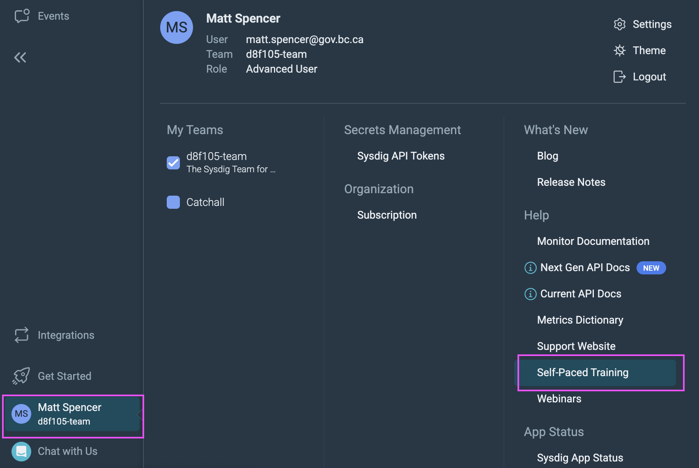
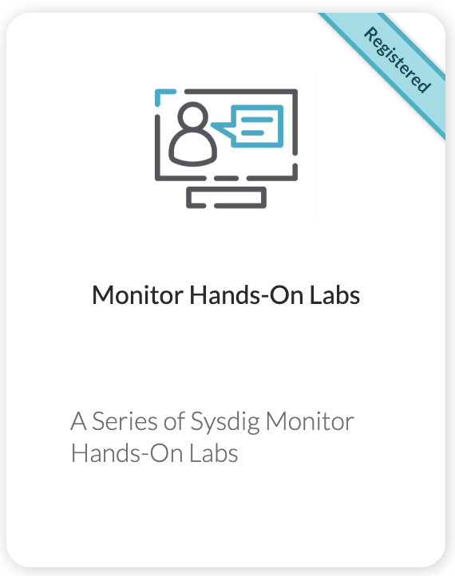

# Sysdig Training 

Last updated: **May 9, 2024**

This page describes how to access training provided by Sysdig to set up monitoring and alerts.  

## Sign in to Sysdig Monitor

Follow the steps listed [here](../app-monitoring/sysdig-monitor-setup-team/#sign-in-to-sysdig) to sign in to Sysdig Monitor. 

## Access the training

Once you've signed in, hover over your username in the bottom-right corner of the web interface. Select the 'Self-paced training' menu option. 

From here, select the 'Monitor Hands-On Labs' training, and register. You can then complete this interactive training when you're ready. Please make sure to set aside some time for completing the labs, as any progress you make will be lost if you're inactive for too long or when you log out. 

## Discuss the training

Please join the rocketchat channel [#sysdig-training](https://chat.developer.gov.bc.ca/channel/sysdig-training) when you start these labs, and share any questions there. 

---

## Related pages

- [#sysdig-training Rocketchat channel](https://chat.developer.gov.bc.ca/channel/sysdig-training)