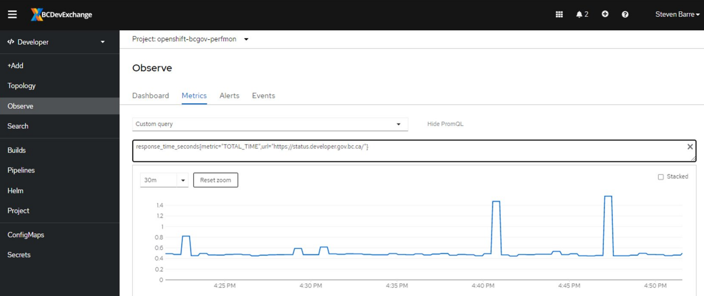
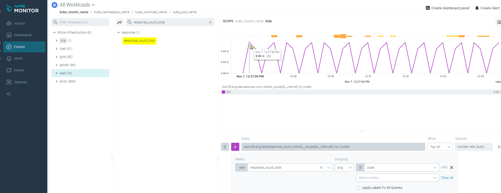
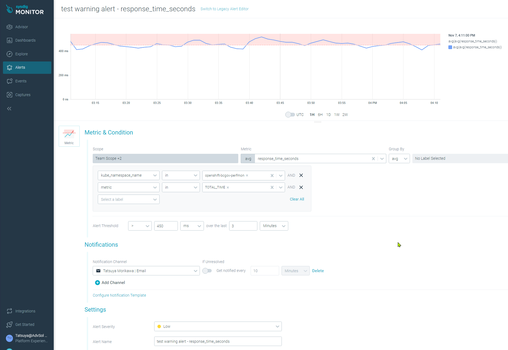
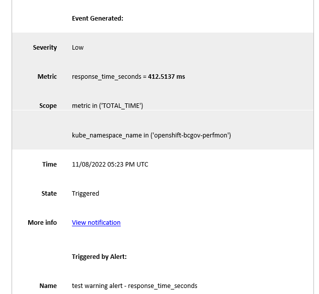

# Set up a User Defined Monitoring in OpenShift
Last updated: **January 5, 2023**

Use Prometheus client libraries to push your app's metrics to Prometheus. 

## On this page

- **[Instrument your application with custom metrics](#instrument-your-application-with-custom-metrics)**
- **[Metric Types](#metric-types)**
  - [Counter](#counter)
  - [Gauge](#gauge)
  - [Histogram and Summaries](#histogram-and-summaries)
- **[Expose the metrics from your app](#expose-the-metrics-from-your-app)**
- **[Create a ServiceMonitor](#create-a-servicemonitor)**
- **[Querying Prometheus](#querying-prometheus)**
- **[Sysdig Monitor](#sysdig-monitor)**
- **[Sysdig Monitor Alert](#sysdig-monitor-alert)**
- **[Monitor user-defined projects using Alertmanager](#monitor-user-defined-projects-using-alertmanager)**
- **[Related pages](#related-pages)**

## Instrument your application with custom metrics

Use one of the [Prometheus Client Libraries](https://prometheus.io/docs/instrumenting/clientlibs/) in your app code. This makes it easy to add metrics, increment counters, and set gauges in the language you are coding in.​

```python
from prometheus_client import start_http_server, Gauge​​

resp_time = Gauge('response_time_seconds', 'Response time in seconds of monitored URLs', ['url'])​

start_http_server(8000)​

resp_time.labels(url=url).set(1.2)
```

The library will then add an HTTP endpoint to your app at /metrics with all the metrics presented.​

```console
$ curl http://localhost:8000/metrics​
# HELP response_time_seconds Response time in seconds of monitored URLs​
# TYPE response_time_seconds gauge​
response_time_seconds{url="http://myapp.com"} 1.2
```

## Metric Types

The Prometheus client libraries provide four core metric types: `Counter`, `Gauge`, `Histogram` , and `Summary`. Currently, these types are only distinguished in the client libraries (to facilitate APIs tailored to each type) and in the wire protocol. The Prometheus server currently doesn't utilize the type information and consolidates all data into untyped time series. This might change in the future.

### Counter

A counter is a cumulative metric that represents a single monotonically increasing counter whose value can only increase or be reset to zero on restart. For example, you can use a counter to represent the number of requests served, tasks completed, or errors.​

[More on Prometheus counter](https://prometheus.io/docs/concepts/metric_types/#counter).

### Gauge

A gauge is a metric that represents a single numerical value that can arbitrarily go up and down.​

Gauges are typically used for measured values like temperatures or current memory usage, but also "counts" that can go up and down, like the number of concurrent requests.​

[More on Prometheus gauge](
https://prometheus.io/docs/concepts/metric_types/#gauge).

### Histogram and summaries

**Histograms** and **summaries** both sample observations, typically request durations or response sizes. They track the number of observations and the sum of the observed values, allowing you to calculate the average of the observed values.​

You can use both summaries and histograms to calculate so-called `φ-quantiles`, where 0 ≤ φ ≤ 1. The `φ-quantile` is the observation value that ranks at number `φ*N among the N observations`.

Examples for φ-quantiles:

- The `0.5-quantile` is known as the `median - 50th percentile`.
- The `0.95-quantile` is the `95th percentile`.​

The essential difference between summaries and histograms is that summaries calculate streaming `φ-quantiles` on the client side and expose them directly, while histograms expose bucketed observation counts and the calculation of quantiles from the buckets of a histogram happens on the server side using the `histogram_quantile()` function.​

[More on Prometheus histogram and summaries](
https://prometheus.io/docs/practices/histograms/).


## Expose the metrics from your app

Now that your app is generating a metrics endpoint, expose it with a Service.​ The key part is making sure the ports match up with what your library is using.

```yaml
apiVersion: v1​
kind: Service​
metadata:​
  labels:​
    app: myapp​
  name: myapp​
spec:​
  ports:​
  - name: metrics​
    port: 8000​
    protocol: TCP​
    targetPort: 8000​
  selector:​
    app: myapp​
  sessionAffinity: None​
  type: ClusterIP 
```

## Create a ServiceMonitor

To use the metrics exposed by your service, you must configure OCP monitoring to scrape metrics from the /metrics endpoint. You can do this using a ServiceMonitor custom resource definition (CRD) that specifies how a service should be monitored.

```yaml
apiVersion: monitoring.coreos.com/v1​
kind: ServiceMonitor​
metadata:​
  labels:​
    app: myapp​
  name: myapp​
spec:​
  endpoints:​
  - interval: 30s​
    port: metrics​
    scheme: http​
  selector:​
    matchLabels:​
      app: myapp
```



## Querying Prometheus

PromQL is a rich language​ and there’s a lot you can do with PromQL to manipulate your metrics and make useful graphs. The docs are quite extensive.​

Learn more about the querying basics on [Prometheus documentation](https://prometheus.io/docs/prometheus/latest/querying/basics/).

**Data is currently stored for 15 days.**

## Sysdig Monitor

You can now let Sysdig agent collecting your custom metrics and show them in the Sysdig console. Add `prometheus.io/scrape=true` annotation set in your pod. The Sysdig agent will scrape your application pod and send its `/metrics` to the Sysdig console.

```yaml
apiVersion: v1
kind: Pod
metadata:
  annotations:
    prometheus.io/scrape: "true"
  labels:
    app: myapp
  name: myapp
  namespace: myapp-namespace
<...>
```

Metrics can be checked from your pod also

```console
$ oc rsh myapp
(app-root) sh-4.4$ curl http://localhost:8000/metrics
# HELP python_gc_objects_collected_total Objects collected during gc
# TYPE python_gc_objects_collected_total counter
python_gc_objects_collected_total{generation="0"} 66.0
<...>
response_size_bytes{metric="REQUEST_SIZE",url="https://nginx-openshift-bcgov-nagios.apps.clab.devops.gov.bc.ca/test.txt"} 270.0
response_size_bytes{metric="SIZE_DOWNLOAD_T",url="https://nginx-openshift-bcgov-nagios.apps.clab.devops.gov.bc.ca/test.txt"} 5.24288e+06
# HELP response_count_total Response by code
# TYPE response_count_total counter
response_count_total{code="200",url="http://nginx-openshift-bcgov-nagios.apps.klab.devops.gov.bc.ca/"} 192.0
response_count_total{code="200",url="http://nginx-openshift-bcgov-nagios.apps.clab.devops.gov.bc.ca/"} 192.0
response_count_total{code="200",url="https://nginx-openshift-bcgov-nagios.apps.klab.devops.gov.bc.ca/"} 192.0
response_count_total{code="200",url="https://nginx-openshift-bcgov-nagios.apps.clab.devops.gov.bc.ca/"} 192.0
response_count_total{code="200",url="https://status.developer.gov.bc.ca/"} 192.0
response_count_total{code="200",url="http://nginx-openshift-bcgov-nagios.apps.klab.devops.gov.bc.ca/test.txt"} 192.0
<...>
```

And same metrics can be seen in the Sysdig monitor web-console.



## Sysdig Monitor Alert

To set up Sysdig alert using your custom metrics, you'll need to create a dashboard with the metrics, and then you can setup an alert like below;



Sysdig alert example;



For detail steps, please read the documents below:

- [Checking sysdig teams and dashboards](/sysdig-monitor-setup-team/#review-your-monitoring-dashboards)
- [Creating sysdig alert](/sysdig-monitor-create-alert-channels/#creating-an-alert)

## Monitor user-defined projects using Alertmanager

Technical preview for our Openshift Clusters (OCP 4.10). It is possible to set up Alertmanager rule for a user-defined projects so that the granted user(s) by the monitoring-rules-edit role can create, modify, and deleting PrometheusRule custom resources for their project. It's coming with OCP 4.11.

---

## Related pages

- [Sysdig - Automatically scraping any Kubernetes pods](https://docs.sysdig.com/en/docs/sysdig-monitor/integrations/working-with-integrations/custom-integrations/collect-prometheus-metrics/#agent-compatibility)
- [Sysdig - Use Service Discovery to import application metrics endpoints](/sysdig-monitor-set-up-advanced-functions/#use-service-discovery-to-import-application-metrics-endpoints)
- [Sysdig - Checking sysdig teams and dashboards](/sysdig-monitor-setup-team/#review-your-monitoring-dashboards)
- [Sysdig - Creating sysdig alert](/sysdig-monitor-create-alert-channels/#creating-an-alert)
- [OCP - Granting users permission to monitor user-defined projects](https://docs.openshift.com/container-platform/4.10/monitoring/enabling-monitoring-for-user-defined-projects.html#granting-users-permission-to-monitor-user-defined-projects_enabling-monitoring-for-user-defined-projects)
- [OCP - Enabling monitoring for user-defined projects](https://access.redhat.com/documentation/en-us/openshift_container_platform/4.10/html/monitoring/enabling-monitoring-for-user-defined-projects)
- [OCP - Enabling alert routing for user-defined projects](https://access.redhat.com/documentation/en-us/openshift_container_platform/4.10/html/monitoring/enabling-alert-routing-for-user-defined-projects)
