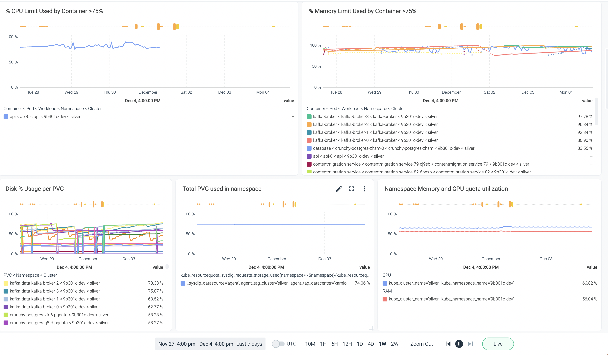

# Resource Monitoring Dashboards
## Prepare for Quota Increase request

To effectively utilize Resource Monitoring Dashboards, ensure that you have your Sysdig team set up and are familiar with creating and using template dashboards. If you're not already familiar with these concepts, please refer to the [Sysdig documentation on creating monitoring dashboards](/sysdig-monitor-create-monitoring-dashboards/).

Additionally, familiarize yourself with our quota approval process before proceeding. You can find details on the [quota approval process here](https://hackmd.io/@jleach/BylJfafRs#Quota-Approval-Process).

## Open PromQL Query under Explore

Sysdig Monitor allows you to leverage PromQL queries to collect resource utilization metrics. Below are some PromQL queries that can assist you in monitoring resource usage:

1. **CPU and Memory Utilization Percentage for Namespace:**
    ```plaintext
    sum by(kube_cluster_name, kube_namespace_name, kube_workload_name)(
    kube_resourcequota_sysdig_limits_cpu_used{cluster=~$cluster,namespace=~$namespace}/kube_resourcequota_sysdig_limits_cpu_hard{cluster=~$cluster,namespace=~$namespace}*100 )
    ```

    ```plaintext
    sum by(kube_cluster_name, kube_namespace_name, kube_workload_name)(
    kube_resourcequota_sysdig_limits_memory_used{cluster=~$cluster,namespace=~$namespace}/kube_resourcequota_sysdig_limits_memory_hard{cluster=~$cluster,namespace=~$namespace}*100)
    ```

2. **Disk % Usage per PVC:**
    ```plaintext
    topk(25,kubelet_volume_stats_used_bytes{kube_cluster_name=~$cluster,namespace=~$namespace} / (kubelet_volume_stats_capacity_bytes{kube_cluster_name=~$cluster,namespace=~$namespace}))
    ```

3. **Total Storage Usage in Percentage in that Namespace:**
    ```plaintext
    kube_resourcequota_sysdig_requests_storage_used{kube_cluster_name=~$cluster,namespace=~$namespace}/kube_resourcequota_sysdig_requests_storage_hard{kube_cluster_name=~$cluster,namespace=~$namespace}*100
    ```

Replace `$cluster` and `$namespace` in these queries with your specific values.

## Creating Dashboard Panels

Once you find these metrics useful, you can create dedicated panels for your dashboard:

1. Click on the "Create" button on the page where the metric is displayed.
2. Customize the panel according to your requirements.
3. Add the panel to your dashboard.

## Dashboard Overview

With the panels created, you can have an overview of the percentage of resources used in a particular namespace. This information is valuable when requesting a quota increase from the Platform Services team.

Understanding your current resource usage and available quota in a namespace provides a clear picture of your application's demands. This knowledge empowers you to make informed requests for additional resources based on real-time data.

Remember to regularly monitor and update your resource dashboards to ensure accurate and up-to-date information is available for decision-making.
Here's a example of this dashboard:


**NOTE** You can zoom out the time scope using the control located at the very bottom of the page, as shown in the image above. It would be more convincing to provide data from 2 weeks or at least 1 week.
---

## Related pages:
[How to use Sysidg Explore](https://docs.sysdig.com/en/docs/sysdig-monitor/explore/using-explore/using-promql-query/)

---