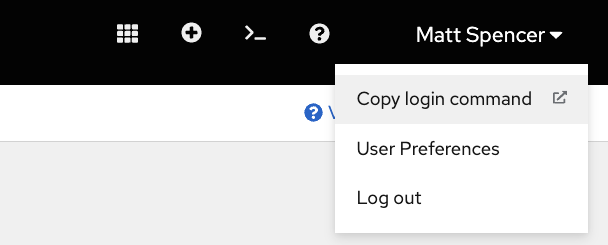

# Install the oc command line tool
Last updated: **May 29, 2023**

Users can interact with OpenShift via the `oc` command line tool. This can be installed on your local machine, or accessed via the web console. It is important to keep your version of `oc` up to date to match the version of `oc` on the cluster. 

## Install oc on a mac

### Install homebrew

Install [homebrew](https://brew.sh/) by running `/bin/bash -c "$(curl -fsSL https://raw.githubusercontent.com/Homebrew/install/HEAD/install.sh)"` in your terminal. 

Be sure to follow the steps in the output to add homebrew to your PATH. 

### Install openshift-cli (oc)

Now that you have homebrew installed, use the command `brew install openshift-cli` to install the `oc` command line tool. When installation is complete, run `oc version` to confirm successful installation. A successful installation should return the version number of `oc`. Please note, `oc version` will also return an error `'error: You must be logged in to the server (Unauthorized)` until you complete the next step. 

### Test oc login

In order to login with the `oc` command line tool, first login to the [OpenShift Web Console](https://console.apps.silver.devops.gov.bc.ca/). For instructions, see the [Login to OpensShift Web Console](/login-to-openshift) page. 

Next, click onto your name in the top-right corner of the screen, and choose 'copy log in command'. 

You'll need to login again when prompted.

Next, you'll be directed to a page with a link to **Display Token**. Please do not share your tokens capture them on screen recordings as these grant access to OpenShift on your behalf. Click the link to reveal your tokens.

Copy the entire line of text under 'Log in with this token'.

Paste this command into your terminal and run it.

If successful, you should see an indication of which cluster you've logged in to, along with the number of projects you have access to and the project you are currently working in.

### Update oc

To ensure compatibility as features change, please update your `oc` command line tool regularly. You can use `brew upgrade openshift-cli` to achieve this if you installed `oc` using [homebrew](https://brew.sh/) as descrbed above. 

<!-- ### Video demo  I'll comment this out until the video is ready-->

## Install oc on windows

### Install wsl 

In the OpenShift 101 training, we suggest that new users install Windows Subsystem for Linux (WSL) first, and then install `oc` within `WSL` using [homebrew](https://brew.sh/). This is to maintain direct compatibility between the commands used across operating systems. 

First, open PowerShell or Windows Command Prompt in administrator mode by right-clicking and selecting "Run as administrator".

Next, run the command `wsl --install`. 

After completion of this command, you'll need to restart your computer to continue installing Ubuntu in WSL. 

During the Ubuntu install process, you'll be prompted to setup a new username and password for the Ubuntu installation. 

### Install homebrew

From within your WSL terminal, install homebrew. 

Install [homebrew](https://brew.sh/) by running `/bin/bash -c "$(curl -fsSL https://raw.githubusercontent.com/Homebrew/install/HEAD/install.sh)"` in your WSL terminal. You'll be prompted for the sudo password that you created earlier. 

Be sure to follow the steps in the output to add homebrew to your PATH. 

### Install openshift-cli (oc)

Now that you have homebrew installed, use the command `brew install openshift-cli` to install the `oc` command line tool. When installation is complete, run `oc version` to confirm successful installation. A successful installation should return the version number of `oc`. Please note, `oc version` will also return an error `'error: You must be logged in to the server (Unauthorized)` until you complete the next step. 

### Test oc login

In order to login with the `oc` command line tool, first login to the [OpenShift Web Console](https://console.apps.silver.devops.gov.bc.ca/). For instructions, see the [Login to OpensShift Web Console](/login-to-openshift) page. 

Next, click onto your name in the top-right corner of the screen, and choose 'copy log in command'. 

You'll need to login again when prompted.

Next, you'll be directed to a page with a link to **Display Token**. Please do not share your tokens capture them on screen recordings as these grant access to OpenShift on your behalf. Click the link to reveal your tokens.

Copy the entire line of text under 'Log in with this token'.

Paste this command into your terminal and run it.

If successful, you should see an indication of which cluster you've logged in to, along with the number of projects you have access to and the project you are currently working in.

### Update oc

To ensure compatibility as features change, please update your `oc` command line tool regularly. You can use `brew upgrade openshift-cli` to achieve this if you installed `oc` using [homebrew](https://brew.sh/) as descrbed above. 

<!-- ### Video demo  I'll comment this out until the video is ready-->

## Use the web terminal

If you can't install `oc` locally, you may wish to use the OpenShift web terminal for some purposes. More information is [available from Redhat](https://docs.openshift.com/container-platform/4.8/web_console/odc-about-web-terminal.html#odc-using-web-terminal_odc-about-web-terminal). 

---

Related links:

- [Homebrew](https://brew.sh/)
- [Login to OpensShift Web Console](/login-to-openshift) 
- [OpenShift Web Terminal - Redhat](https://docs.openshift.com/container-platform/4.8/web_console/odc-about-web-terminal.html#odc-using-web-terminal_odc-about-web-terminal)

---
