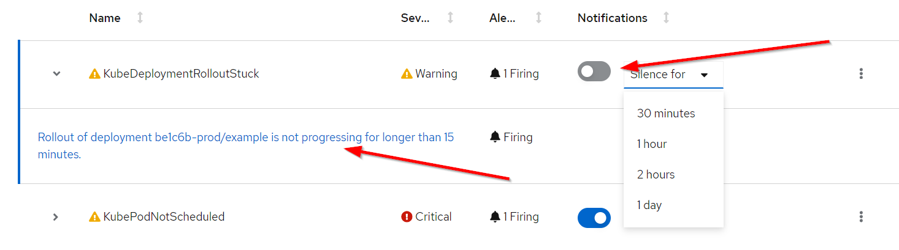
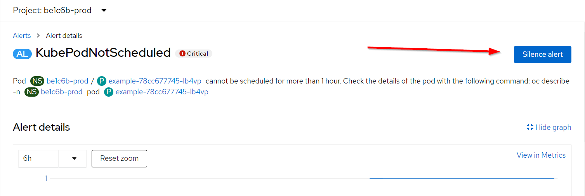
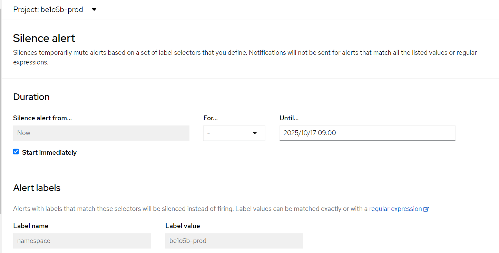

<!-- omit in toc -->
# AlertManager
Last updated: **Oct 29, 2024**

We've enhanced OpenShift clusters with basic monitoring and alerting features to keep product teams informed about their applications' health. These features send alerts to the contacts specified in the [Product Registry](https://registry.developer.gov.bc.ca/), notifying them of any common issues their apps might face.

<!-- omit in toc -->
## On this page

- [Alert contacts](#alert-contacts)
- [Frequency](#frequency)
- [Alerts](#alerts)
- [View in web console](#view-in-web-console)
- [Silencing alerts](#silencing-alerts)
- [Objects](#objects)
- [Related pages](#related-pages)

## Alert contacts

Alert emails come from `CLUSTER AlertManager <PlatformServicesTeam@gov.bc.ca>` where CLUSTER is the name of the cluster generating the alert for example: `GOLD`.

Technical Leads for the Product receive all alerts. Additionally, critical level alerts in the `-prod` namespace are forwarded to the Product Owner.

The subject of the emails will contain the namespace name, which you can use for filtering your emails. ie: `Action Required: be1c6b-prod has critical alerts firing`

The body of the email will also contain the display name of the Product as it is listed in the Registry.

## Frequency

Alerts are triggered only if the condition persists for 1 hour, minimizing unnecessary alerts during ongoing changes.

Unresolved alerts are re-sent to the contacts. The frequency is based on the severity and environment.

Critical alerts:

- Tools are resent every 48 hours
- Dev are resent every 24 hours
- Test are resent every 12 hours
- Prod are resent every 1 hour

Warning and Info alerts:

- Tools are resent every 5 days
- Dev are resent every 4 days
- Test are resent every 2 days
- Prod are resent every 1 day

For non-Prod environments, alert emails are only sent during business hours. Monday to Friday 16:00 UTC to 00:00 UTC (8am-4pm PST / 9am-5pm PDT).

## Alerts

| **Name** | **Severity** | **Description** |
|---|---|---|
| KubePodCrashLooping | Critical | Pod is stuck in a CrashLoop |
| KubePodNotReady | Critical | Pod is not passing its Readyness probe |
| KubeDeploymentReplicasMismatch | Warning | Deployment has the wrong number of replicas |
| KubeDeploymentGenerationMismatch | Warning | Indicates that the Deployment has failed but has not been rolled back |
| KubeDeploymentRolloutStuck | Warning | Deployment update has not been rolled out |
| KubeStatefulSetReplicasMismatch | Warning | StatefulSet has the wrong number of replicas |
| KubeStatefulSetGenerationMismatch | Warning | Indicates that the StatefulSet has failed but has not been rolled back |
| KubeStatefulSetUpdateNotRolledOut | Warning | StatefulSet update has not been rolled out |
| KubeContainerWaiting | Critical | Container has been in a waiting state for too long |
| KubeJobNotCompleted | Warning | Job has taken more than 12 hours to complete |
| KubeJobFailed | Warning | Job has failed |
| KubeHpaReplicasMismatch | Warning | HPA does not matched the desired number of replicas, often a quota issue |
| KubeHpaMaxedOut | Warning | HPA is running at max replicas |
| KubePodNotScheduled | Critical | Pod cannot be scheduled to a node |
| KubePersistentVolumeUnbound | Warning | PVC is not bound to a PV |
| KubePersistentVolumeFillingUp | Warning | PVC is 97% full |
| KubePersistentVolumeFillingUp | Warning | PVC is predicted to be full in 4 days |
| KubePersistentVolumeInodesFillingUp | Warning | PVC is running out of free inodes |
| KubePersistentVolumeInodesFillingUp | Warning | PVC is predicted to run out of inodes in 4 days |
| PodDisruptionBudgetAtLimit | Warning | The pod disruption budget is at the minimum disruptions allowed level. The number of current healthy pods is equal to the desired healthy pods. |
| PodDisruptionBudgetLimit | Critical | The pod disruption budget is below the minimum disruptions allowed level and is not satisfied. The number of current healthy pods is less than the desired healthy pods. |

## View in web console

In the **Developer** perspective, select **Observe** -> **<project_name>** -> **Alerts**. In this perspective, alerts, silences, and alerting rules are all managed from the **Alerts** page. The results shown in the **Alerts** page are specific to the selected project.

## Silencing alerts

From the **Alerts** page, you can also disable notifications for a specific alert for a period of time. For quick silences, toggle the Notification button and select a time from the dropdown.

For longer silences, click on the specific firing alert.

From the Alert page, select **Silence alert** from the top-right.

On the **Silence** page, you can select a time, or specify a custom one. You can even pick a date far in the future if you don't want to know about this specific alert at all.

You can then customize which alert labels are matched. This can let you create a silence that covers a group of alerts.

## Objects

The `platform-services-controlled-alert-routing` configuration in the `AlertManagerConfig` object determines the recipients of the emails, and it doesn't allow any changes.

The `PrometheusRule` object named `platform-services-controlled-alert-rules` outlines the alert rules and their conditions. It's important to note that modifications to this are not allowed.

Feel free to make new `PrometheusRule` objects. They'll be sent to the existing contacts already in place.

---
---

## Related pages

- [User Defined Monitoring in OpenShift](../app-monitoring/user-defined-monitoring.md)
- [RedHat’s documentation on managing alerts](https://docs.openshift.com/container-platform/4.14/monitoring/managing-alerts.html)
