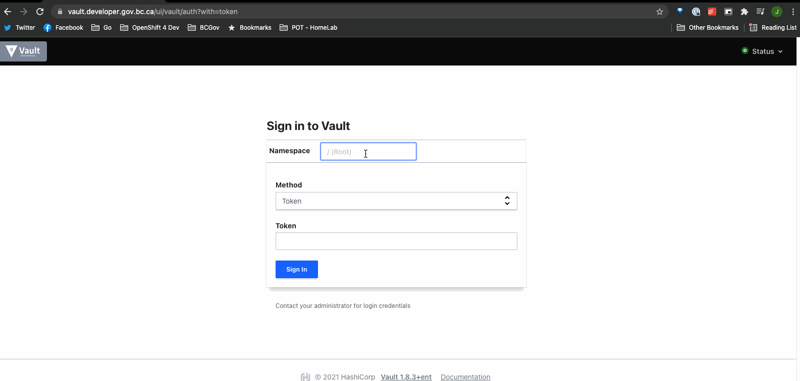

# Vault getting started guide

The Platform Services team has deployed Hashicorp's Vault application with disaster recovery in our Gold service clusters (Gold Kamloops and Gold Calgary). The service is available to all B.C. government development teams on **all clusters** including: Silver, Gold/GoldDR and Emerald.

The Vault service is available at [https://vault.developer.gov.bc.ca/](https://vault.developer.gov.bc.ca/).
If you are running a test project in the lab clusters, such as KLAB, use the lab instance of Vault at [https://vault-lab.developer.gov.bc.ca/](https://vault-lab.developer.gov.bc.ca/).

In this guide, you will learn how to access Vault and deploy a working example using sample secrets from your Vault Mount Points. Mount Points can be thought of as "MiniVaults" or related to paths within a Linux filesystem that can be locked down and secured.

## On this page

- [Access](#access)
  - [User access for managing Vault secret resources](#user-access-for-managing-vault-secret-resources)
    - [Log in to Vault UI](#log-in-to-vault-ui)
    - [Log in to Vault CLI](#log-in-to-vault-cli)
    - [Verify your Vault resources](#verify-your-vault-resources)
  - [Kubernetes Service Account Access for application secret usage](#kubernetes-service-account-access-for-application-secret-usage)
    - [Vault secret structures](#vault-secret-structures)
    - [Sample deployment using the Kubernetes Service Account](#sample-deployment-using-the-kubernetes-service-account)
- [Support](#support)
- [References](#references)

## Access

There are two types of access to manage secrets on Vault,

- User Access
- Kubernetes Service Account (KSA) Access

User Access gives authorized users the ability to create and write secrets, while KSA Access only provides read access, which is used for application pods to pull secret values from Vault.

### User access for managing Vault secret resources

User Access is controlled through a combination of Red Hat Single-Sign On (KeyCloak) and automation integrated with the [Platform Services Registry](https://registry.developer.gov.bc.ca/).

For each OpenShift Project Set ($LICENSE_PLATE-dev/test/prod/tools - eg: abc123-dev, abc123-test, abc123-prod, abc123-tools), just the two technical contacts are granted access, due to the user limits of the Vault license. These technical contacts are given write access to the Mount Points set up by the registry.

#### Log in to Vault UI

1. Head over to <https://vault.developer.gov.bc.ca/>

2. Enter `platform-services` for the **Namespace**

3. Select `OIDC` for the **Method**

4. Enter your `LICENSE_PLATE` for the **Role** (example uses `abc123` as the `LICENSE_PLATE`)

5. Click **Sign In** and login with AzureAD IDIR through SSO (Currently only Technical Leads entered in Product Registry service will have access)



#### Log in to Vault CLI

1. Set Environment Variables

    > please replace `abc123` with your project set license plate

    ```bash
    export LICENSE_PLATE=abc123
    export VAULT_NAMESPACE=platform-services
    export VAULT_ADDR=https://vault.developer.gov.bc.ca
    ```

2. Login

    ```console
    ❯ vault login -method=oidc role=abc123
    Complete the login via your OIDC provider. Launching browser to:

        https://oidc.gov.bc.ca/auth/realms/...
    ```

3. Sign in with OIDC

4. Go back to the terminal

    ```console
    Success! You are now authenticated. The token information displayed below
    is already stored in the token helper. You do NOT need to run "vault login"
    again. Future Vault requests will automatically use this token.

    Key                    Value
    ---                    -----
    token                  <token>
    token_accessor         <string>
    token_duration         768h
    token_renewable        true
    token_policies         ["default" "abc123"] # 'abc123' == $LICENSE_PLATE
    identity_policies      []
    policies               ["default" "abc123"] # 'abc123' == $LICENSE_PLATE
    token_meta_email       justin@**********
    token_meta_role        abc123 # 'abc123' == $LICENSE_PLATE
    token_meta_username    shelly.han@gov.bc.ca
    ```

#### Verify your Vault resources

Once authenticated to Vault you will see three secret engines:

- `$LICENSE_PLATE-prod`
- `$LICENSE_PLATE-nonprod`
- `cubbyhole`

The prod secret engine can be used for production namespace. While tools, dev and test namespaces will share the nonprod secret engine as the naming suggests. The cubbyhole secret engine was not used in our environment.

Each secret engine has been provisioned with a sample `helloworld` secret. Confirm those can be read either by viewing the secret value or with the following commands:

- nonprod
    ```console
    ❯ vault kv get $LICENSE_PLATE-nonprod/helloworld
    ====== Metadata ======
    Key              Value
    ---              -----
    created_time     2021-11-03T17:34:48.876436495Z
    deletion_time    n/a
    destroyed        false
    version          3

    ==== Data ====
    Key      Value
    ---      -----
    hello    world
    ```

- prod
    ```console
    ❯ vault kv get $LICENSE_PLATE-prod/helloworld
    ====== Metadata ======
    Key              Value
    ---              -----
    created_time     2021-10-26T14:35:30.568419117Z
    deletion_time    n/a
    destroyed        false
    version          1

    ==== Data ====
    Key      Value
    ---      -----
    hello    world
    ```

### Kubernetes Service Account Access for application secret usage

Kubernetes Service Account (KSA) Access is configured using k8s authentication. Vault is configured with a unique k8s auth path for each cluster that has Vault enabled.

The Vault KSA name takes the form of `$LICENSE_PLATE-vault` in all project set namespaces. This service account should be used for the Resource that will control your pods (from Deployments, StatefulSets, etc). Additional Roles can be bound to this KSA through a RoleBinding with the desired Role if application requires it.

#### Vault secret structures

We organized our secrets as follows:

```
$LICENSE_PLATE-nonprod                  #secret engine
- |---myapp-secret-dev                  #secret name
-     |---dev_database_host             #secret data
-     |---dev_database_name             #secret data
-     |---dev_service_account           #secret data
-     |---dev_service_account_pass      #secret data

- |---myapp-secret-debug                #secret name
-     |---dev_hostname                  #secret data
-     |---dev_toolbox                   #secret data

- |---myapp-secret-test                 #secret name
-     |---test_database_host            #secret data
-     |---test_database_name            #secret data
-     |---test_service_account          #secret data
-     |---test_service_account_pass     #secret data

$LICENSE_PLATE-prod                     #secret engine
- |---myapp-secret-prod                 #secret name
-     |---prod_database_host            #secret data
-     |---prod_database_name            #secret data
-     |---prod_service_account          #secret data
-     |---prod_service_account_pass     #secret data
```

> NOTE: Don't use a hyphen in a "key".  Vault will accept the value but it's problematic in the OpenShift templates which shows up as an error in the vault-init container.

#### Sample deployment using the Kubernetes Service Account

When you look at the [vault-demo-app](https://github.com/bcgov/platform-services-vault-demo-app) you'll see there's already a deployment template to assist. The three important parts of this vault demo are:

- part 1 - `annotations`
- part 2 - `serviceaccount`
- part 3 - source secret file

**Part 1 - Annotation**
We elected to use the annotation / Vault Agent Injector method. [This was helpful from Hashicorp](https://www.vaultproject.io/docs/platform/k8s/injector/examples).

In the following example, it contains the minimum configuration needed for Vault init container to work. If you are looking for advanced configurations, such as vault init container resource config and so on, options can be found from the [annotation doc](https://www.vaultproject.io/docs/platform/k8s/injector/annotations)!

> Note: Learn from my mistake in the Deployment. Place the annotation in the correct location. In the "Deployment" it belongs in the "metadata" portion of "template" NOT the root metadata section:

```yaml
kind: Deployment
apiVersion: apps/v1
metadata:
  name: myapp
  labels:
    app: myapp
  annotations:
    # NOT HERE!!!
spec:
  replicas: 3
  selector:
    matchLabels:
      app: myapp
  template:
    metadata:
      labels:
        app: myapp
      annotations:
        # 1. Vault injector configuration goes here, inside the template.
        vault.hashicorp.com/agent-inject: 'true'
        vault.hashicorp.com/agent-inject-token: 'false' # set to 'true' if you are going to connect and query vault from your application
        vault.hashicorp.com/agent-pre-populate-only: 'true' # this makes sure the secret vault will only change during pod restart
        vault.hashicorp.com/auth-path: auth/k8s-silver  # Must match cluster. Use one of: auth/k8s-silver, auth/k8s-gold, auth/k8s-golddr, auth/k8s-emerald
        vault.hashicorp.com/namespace: platform-services
        vault.hashicorp.com/role: abc123-nonprod  # licenseplate-nonprod or licenseplate-prod are your options

        # Configure how to retrieve and populate the secrets from Vault:
        # - The name of the secret is any unique string after vault.hashicorp.com/agent-inject-secret-<name>
        # - The value is the path in Vault where the secret is located.
        vault.hashicorp.com/agent-inject-secret-myapp-secret-dev: abc123-nonprod/myapp-secret-dev
        # - The template Vault Agent should use for rendering a secret:
        vault.hashicorp.com/agent-inject-template-myapp-secret-dev: |
          {{- with secret "abc123-nonprod/myapp-secret-dev" }}
          export dev_database_host="{{ .Data.data.dev_database_host }}"
          export dev_database_name="{{ .Data.data.dev_database_name }}"
          {{- end `}} }}

        # - This is another sample. This set uses some HELM chart variable replacements. There's a bit of magic with the ` symbol in the agent-inject-template section. It also required some additional braces {}. You can use this as an example of what worked for me.
        vault.hashicorp.com/agent-inject-secret-myapp-secret-debug: {{ .Values.global.licenseplate }}-{{ .Values.global.vault_engine }}/myapp-secret-debug
        vault.hashicorp.com/agent-inject-template-myapp-secret-debug: |
          {{`{{- with secret `}}"{{ .Values.global.licenseplate }}-{{ .Values.global.vault_engine }}/myapp-secret-debug"{{` }}
          export dev_hostname="{{ .Data.data.dev_hostname }}"
          export dev_toolbox="{{ .Data.data.dev_toolbox }}"
          {{- end `}} }}
    spec:
      # 2. Service Account
      serviceAccountName: abc123-vault
      # or for HELM with var replacements use:
      #serviceAccountName: {{ .Values.global.licenseplate }}-vault

      # 3. how to use the secret:
      containers:
        - name: app
          args:
          ['sh', '-c', 'source /vault/secrets/myapp-secret-dev && <entrypoint_script>']
          ...
          ...
```

Looking for a simplified way to setup the secret environment variables? Take a look [at this example](https://stackoverflow.developer.gov.bc.ca/questions/1060/1061#1061).

Do you reach a resource quota limit? Configure the Vault Agent container's requests and limits in the [annotations](https://developer.hashicorp.com/vault/docs/platform/k8s/injector/annotations).

```yaml
vault.hashicorp.com/agent-requests-cpu: '10m'
vault.hashicorp.com/agent-limits-cpu: '50m'
vault.hashicorp.com/agent-requests-mem: '25Mi'
vault.hashicorp.com/agent-limits-mem: '100Mi'
```


**Part 2 - Vault Service Account**

Note the additional line under spec with `2. Service Account`. This is the service account that is needed to connect to the Vault. This account has been created already for you in OpenShift so on the surface it's straight forward.

There's an issue to be aware of with using this service account (SA): your application container will also use this SA to pull images and for management. So if you are using an image from your tools namespace, make sure to add an ImagePuller rolebinding to the SA. If you are using Artifactory, add the imagePullSecrets to either the SA or the deployment spec.

**Part 3 - How to use secrets in application container**

The Vault init container will create local files with the secret key-value pairs pulled from Vault. They are saved at the path `/vault/secrets/<name>` where name is the secret name you specified in the annotation above. Unlike OpenShift secrets, they are not presented to app containers as environment variables directly. You will have to source the secret files first! See `3. how to use the secret` from the above example.

> Note: there are different ways to use the secrets, check out [more examples here](https://www.vaultproject.io/docs/platform/k8s/injector/examples#vault-agent-injector-examples).

## Support

Support is provided via the [#devops-vault](https://chat.developer.gov.bc.ca/channel/devops-vault) channel in RocketChat!

## References

- [Vault KV2 Usage - Official](https://www.vaultproject.io/docs/secrets/kv/kv-v2#usage)
- [Vault Annotations - Official](https://www.vaultproject.io/docs/platform/k8s/injector/annotations)
