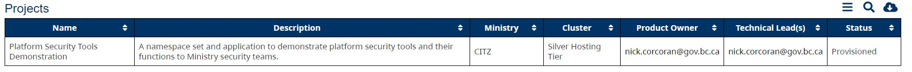
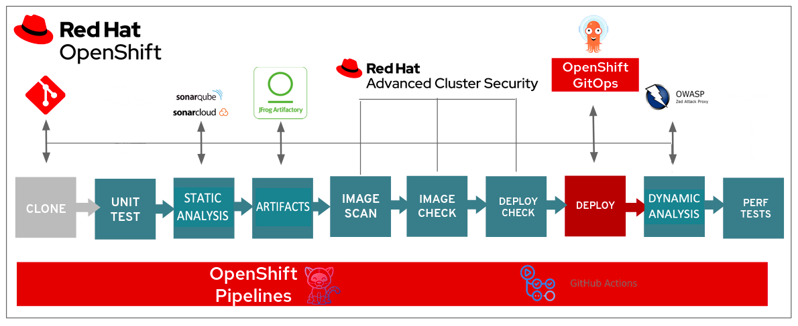
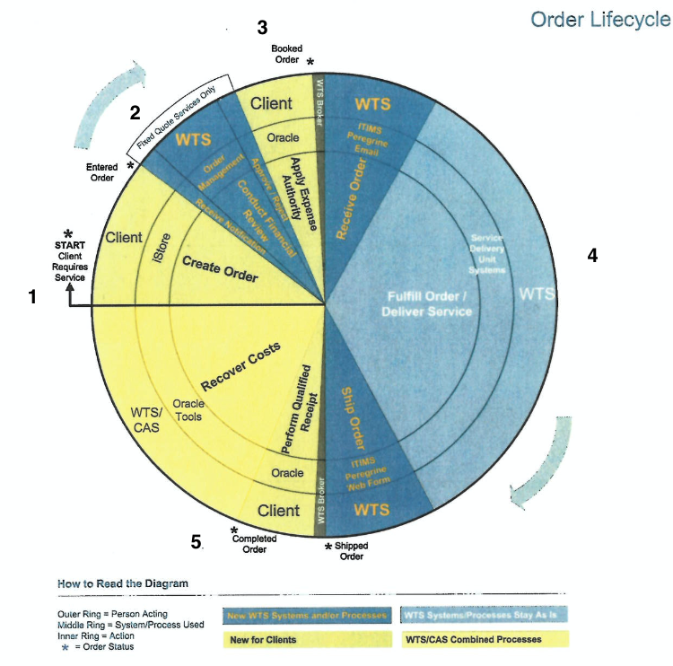
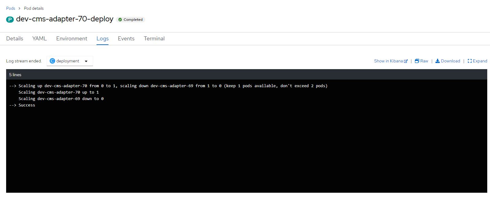

# B.C. Government OpenShift DevOps security considerations
Last updated: **November 2, 2023**

Through this document you'll find some details on our OpenShift service, completed compliance activities and security controls we have in place on our OpenShift implementations.  You'll aso find details on tools to help you secure the products you develop and/or host on OpenShift.

## On this page
* [**DevOps security tools and capabilities**](#devops-security-tools-and-capabilities)
* [**Platform tools security assessments**](#platform-tools-security-assessments)
* [**STRA and PIA requirements for applications**](#stra-and-pia-requirements-for-applications)
* [**Platform Product Registry**](#platform-product-registry)
* [**Communications**](#communications)
* [**Access management**](#access-management)
* [**Kubernetes Network Policies (KNPs)**](#kubernetes-network-policies-knps)
* [**Pipeline templates (includes static and dynamic analysis)**](#pipeline-templates-includes-static-and-dynamic-analysis)
* [**Container image scanning (ACS, Xray)**](#container-image-scanning-acs-xray)
* [**Container runtime security**](#container-runtime-security)
* [**TLS certificates**](#tls-certificates)
* [**Secrets management**](#secrets-management)
* [**GitOps/Cluster configuration management**](#gitopscluster-configuration-management)
* [**Application Programmable Interface (API) management**](#application-programmable-interface-api-management)
* [**Logging and monitoring (EKS, Kibana, Graphana, Sysdig Monitor, SIEM, Uptime, Status)**](#logging-and-monitoring-eks-kibana-graphana-sysdig-monitor-siem-uptime-status)
* [**Backups**](#backups)
* [**Change management**](#change-management)
* [**DevOps Team recommendations for Protected C data creation, storage and use**](#devops-team-recommendations-for-protected-c-data-creation-storage-and-use)
* [**Other important considerations**](#other-important-considerations)
* [**Related pages**](#other-important-considerations)

<!-- ### End of "On this page" --> 
---

## DevOps security tools and capabilities
There are a number of tools available to developers working on the OpenShift platform to help ensure the confidentiality, integrity and availability of data within those systems.  This is an overview of those tools, with links to specifics on each of the resources.

### OpenShift Platform security 
The OpenShift platform security actively protects your applications and data, keeping them safe from unauthorized access and potential threats. OpenShift consistently updates and patches to address vulnerabilities, ensuring a robust defense against evolving security risks. 

If you'd like to find more details about its capabilities, check the our useful [guide for the private cloud hosting 101](https://digital.gov.bc.ca/cloud/services/private/intro/).

We offer three type of platforms: 

* **Silver Service** is our standard DevOps platform offering, with on-cluster resiliency based on application design.

* **Gold Service** is an enhanced DevOps platform offering, with replication to a secondary cluster for disaster fail-over purposes.  

* **Emerald Service** is an enhanced DevOps platform offering, with strict software defined networking (SDN) based on workload security labeling.  This services allows for easier integration with legacy systems and virtual machines (VMs).

While the Platform Services Team manages infrastructure, OpenShift Container Platform and the Platform critical services as part of the Private Cloud PaaS, the Product Team bears the responsibility for the functionality and operations of their application(s) hosted on the Platform.  

Take note of the [**Shared Responsibility Model**](https://digital.gov.bc.ca/cloud/services/private/onboard/) breakdown within the Memorandum of Understanding (MoU).  

You can also find specific details on OpenShift's security controls under [Red Hat's OpenShift security guide](https://www.redhat.com/rhdc/managed-files/cl-openshift-security-guide-ebook-us287757-202103.pdf) which  are also highlighted as part of the OpenShift STRA.

### Penetration tests

The platform services team outsources for a penetration test annually to ensure the services we provide are configured to protect confidentiality, integrity and availability.  Penetration tests are procured through the [pre-qualified list of vendors](https://www2.gov.bc.ca/gov/content/governments/services-for-government/information-management-technology/information-security).

### Privacy
The OpenShift Container Platform service has undergone a Privacy Impact Assessment. Personal information up to and including Protected B Information Security Classification may be stored on OpenShift.  

Have a look at the [B.C. government information security classification](https://www2.gov.bc.ca/gov/content/governments/services-for-government/information-management-technology/information-security/information-security-classification) to find additional details on how information is managed and classified. 

### Critical Systems Standard

<!-- ###  FYI In the future this area may need to be updated and find out if CITZ Security team has reviewed the documentation  -->

Any IM/IT service, system, or infrastructure component that is deemed necessary by the **system owner** to deliver a **mission critical function**, is a critical system for the purposes of this standard. 

We have completed all required documentation for the Critical Systems Standard, and currently under review by the  CITZ Security team.

## Platform tools security assessments

Many of the platform tools have **completed** security assessments.  These include:

* OpenShift v4.10 and VMWare NSX-T
* OpenShift v4.x and GitHub (Public)
* KeyCloak
* KeyCloak Realm Registry
* KeyCloak Common Host Single Sign-on
* Artifactory
* Sysdig Monitor
* Just Ask!
* Certbot
* Mautic
* Rocket.Chat
* Vault
* OCP Application Resource Tuning Advisor
* Uptime.com
* Stack Overflow
* Platform Product Registry (v2)
* GitHub Enterprise
* 1Password (SoAR complete, Cloud security schedule review complete) - was previously discouraged corporately due to no background checks for staff/contractors, but this has since changed.  Further review required to support use.

If you cannot find a tool from the above list and/or require specific information please contact the [platform services team](mailto:PlatformServicesTeam@gov.bc.ca).

## STRA and PIA requirements for applications

Product teams are responsible for completing a [Security Threat and Risk Assessment (STRA)](https://www2.gov.bc.ca/gov/content/governments/services-for-government/information-management-technology/privacy/privacy-impact-assessments) and [Privacy Impact Assessment (PIA)](https://www2.gov.bc.ca/gov/content/governments/services-for-government/information-management-technology/privacy/privacy-impact-assessments) for their applications developed and/or hosted on the OpenShift platform.  

This requirement is highlighted as part of the [Memorandum of Understanding](https://digital.gov.bc.ca/cloud/services/private/onboard/) agreement as part of onboarding to the platform, under the **Product Team Responsibilites** section.

Please connect with your ministry security and privacy specialists to complete the STRA and PIA for your product:

* [Ministry Information Security Officer (MISO)](https://www2.gov.bc.ca/gov/content/governments/services-for-government/policies-procedures/information-security-policy-and-guidelines/role-of-miso)
* [Ministry Privacy Officer (MPO)](https://www2.gov.bc.ca/gov/content/governments/services-for-government/information-management-technology/privacy/resources/privacy-officers) 

## Platform Product Registry

The [Platform Product Registry](https://registry.developer.gov.bc.ca/) is a self-serve online tool that allows you to request new products in the B.C. Government Private Cloud PaaS.

Here, we maintain a listing of all products with deployments on each OpenShift cluster. 

Find out more about the benefits and its use in our [Platform Product Registry information page](https://digital.gov.bc.ca/cloud/services/private/products-tools/registry/)

## Communications
Subscribe to the [DevOps Platform Services communications](https://subscribe.developer.gov.bc.ca/) to  stay seamlessly connected, receiving  updates, insightful new, and platform content.

### Rocket.Chat
Community sharing, alerts, and discussions occur on Rocket.Chat, hosted as an app on OpenShift. Authentication is done through IDIR or GitHub in the [BCGov org](https://just-ask.developer.gov.bc.ca/) or invited by an existing member. 

Find more information about [joining Rocket.Chat](https://mvp.developer.gov.bc.ca/docs/default/component/bc-developer-guide/rocketchat/steps-to-join-rocketchat/).

### Mautic
Mautic has been implemented to allow for subscription based communications for the DevOps community. 

* Find out more about [B.C. gov's Mautic's OpenShift - GitHub](https://github.com/bcgov/Mautic-Openshift)
* Find out more about [B.C. gov's Mautic's subscription based app - Github](https://github.com/bcgov/Mautic-Subscription-App)

## Access management
Our OpenShift access is managed through the OpenShift SSO Service, currently using KeyCloak.

* More information on [SSO-Onboarding with KeyCloa - GitHub](https://github.com/bcgov/sso-keycloak/wiki/SSO-Onboarding)
* More information on using the self-service app to integrate with B.C. government approved login services. [Request SSO Integration](https://bcgov.github.io/sso-requests)

Government users and contractors may login to OpenShift clusters with a GitHub or IDIR account (depending on which cluster they choose).  Both of these options require an account with 2FA/MFA enabled.  

* GitHub - KLAB, CLAB, Silver, Gold, GoldDR  
* IDIR - All clusters (above + KLAB2, Emerald)
* [GitHub 2 factor autenthication (2FA)](https://docs.github.com/en/authentication/securing-your-account-with-two-factor-authentication-2fa/configuring-two-factor-authentication) 
* [IDIR MFA](https://www2.gov.bc.ca/gov/content/governments/services-for-government/information-management-technology/information-security-mfa)

Cluster roles are managed either in private GitHub repositories in the [bcgov-c org](https://github.com/bcgov) or through direct role bindings within a namespace.

Read about the [Platform services roles and responsibilities](https://digital.gov.bc.ca/cloud/services/private/onboard/)

The Platform Services team maintains an Access Control Policy for all platform tools and they can be found in the [internal resources section](https://digital.gov.bc.ca/cloud/services/private/internal-resources/). To access it select Login with Keycloak.

## Kubernetes Network Policies (KNPs)

Network policies help the platform and project teams to better control communications between components.  While KNPs only apply as **ingress rules** (not egress), they help to improve our overall security posture.  KNPs only apply to on-cluster communications (i.e. between pods in a namespace, or between namespaces).  

Find our more about using KNPs to control network security for an application hosted on the Private Cloud Openshift Platform in the [OpenShift network policies](../platform-architecture-reference/openshift-network-policies.md) document. More details on [KPN's official site](https://kubernetes.io/docs/concepts/services-networking/network-policies/).

For products requiring policies that reach off-cluster, the Emerald cluster is the best choice.  This provides a way to communicate with VMs in the SDN zone, and more isolated communications to legacy network zones (B/C).  This capability is provided through the use of VMWare NSX.

## Pipeline templates (includes static and dynamic analysis)

In order to reduce effort in implementing secure tools into a build pipeline, we have developed pipeline templates that include components for build, aas well as static and dynamic vulnerability scanning.  
* [Access Pipeline templates](https://github.com/bcgov/Security-pipeline-templates/)

Here is a representation of what an application build pipeline should look like:

The pipeline templates above make it easier to include the tools described below:

* [SonarQube in the BC Gov Private Cloud PaaS](../reusable-code-and-services/reusable-services-list.md#sonarqube-in-the-bc-gov-private-cloud-paas)
* [OWASP ZAP Security Vulnerability Scanning](../reusable-code-and-services/reusable-services-list.md#owasp-zap-security-vulnerability-scanning)

### Scanning tools roles 

* **Static Analysis (i.e. SonarX, CodeQL)** identifies coding issues that could lead to compromise, back doors, secrets, etc
* **Dynamic Analysis (i.e. OWASP ZAP)** tests against a live version of app for injection, Cross-site scripting (XSS), and other [common web attacks](https://owasp.org/www-project-top-ten/)
* **Image Analysis** ensures image components are up-to-date and not vulnerable to [known exploits](https://cve.mitre.org/) and through the  [national vulnerability database](https://nvd.nist.gov/).

## Container image scanning (ACS, Xray)
Image scanning/analysis comes in 2 forms - 1 active (RedHat Advanced Cluster Security - ACS), 1 passive (XRay).

### ACS

This tool allows us to scan image registries and running containers for image vulnerabilities.  

* It allows us to create policies at build, deploy, and runtime.  
* It can also help in defining network security policies for your application and visualizing component communications.

Scoped access is granted based on identification as a Product Owner or Technical Lead in the OpenShift Product Registry.  
Developer access can be granted by request.  Requests must include the following:

- Namespaces
- Product owner approval

For further information:

* [Access ACS](https://acs.developer.gov.bc.ca)
* Learn about our platform's [cluster security](https://digital.gov.bc.ca/cloud/services/private/products-tools/cluster-security/)
* Learn about [advanced cluster security kubernetes](https://www.redhat.com/en/technologies/cloud-computing/openshift/advanced-cluster-security-kubernetes)
* Sign up for an [ACS workshop with RedHat](https://redhat-scholars.github.io/acs-workshop/acs-workshop/index.html)

### XRay

An add-on capability to Artifactory, XRay scans images and other artifacts for component vulnerabilities.  Anyone with access to an image or artifact within Artifactory can see the XRay tab as part of the image/artifact details, and see what vulnerable components lie within, and what version will correct that deficiency. 

 * Get access to [Artifactory](https://artifacts.developer.gov.bc.ca/ui/login/)

## Container runtime security

We currently have runtime policies in place for the following using ACS.  These look for things like:

* Cryto-mining
* [Integrity monitoring](https://docs.openshift.com/acs/3.66/operating/manage-security-policies.html)

Additionally, OpenShift uses [CoreOS and the CRI-O container engine](https://docs.openshift.com/container-platform/4.10/architecture/architecture-rhcos.html)

## TLS certificates

OpenShift uses a wildcard certificate for the majority of cluster communications security.  This should be sufficient for dev and test workloads, but for production workloads, each team is required to obtain a dedicated TLS certificate from the Access & Directory Management Services (ADMS) team.  

By default, the wildcard will be used to protect project workloads.  The Platform Services team worked through the wildcard issuance requirements for use on the OpenShift clusters.  Obtaining a dedicated TLS cert is currently a manual process.  Find out more about the details on [these processes](https://ssbc-client.gov.bc.ca/services/SSLCert/documents.htm). 

**Pre-requisites:**
Generate a **.csr** for [each site](https://github.com/BCDevOps/openshift-wiki/blob/master/docs/SSLCerts/GenerateCertificateSigningRequest.md)

**Ordering Process:**

1. Business area creates/submits order via [MyServiceCentre](https://ociomysc.service-now.com/sp/)
2. Ministry Service Desk reviews order, sends to EA for Approval
3. EA Approves
4. Order is sent to DXC for fulfillment
5.  Once order is fulfilled/shipped by DXC, Ministry Service Desk sends 'Completed Order' notification to business area

## Secrets management
**OpenShift Secrets:**

This 'secrets' store should actually only be used for configurations.  Values are encoded as base64 and **not** encrypted.  However, these 'secrets' can only be accessed with a role to a given namespace with permission to access them.  Additionally, the physical etcd volume, where OpenShift secrets are stored, is encrypted.

**Vault:**
Vault is the preferred secrets management tool to use on OpenShift.

* Find out more about the [benefits of using Vault](https://digital.gov.bc.ca/cloud/services/private/products-tools/vault/)
* [Vault secrets management service](../security-and-privacy-compliance/vault-secrets-management-service.md)
* [Vault getting started guide](../security-and-privacy-compliance/vault-getting-started-guide.md)

## GitOps/Cluster configuration management

Argo CD (integrated into OpenShift as the GitOps Operator) provides a GitOps capability for sync'ing a Git repository with an OpenShift configuration (platform or application)

## Application Programmable Interface (API) management

The Data BC team hosts an API Gateway for use by other government clients. 

Details can be found here:

* [B.C. government API Program Services](https://www2.gov.bc.ca/gov/content/data/about-data-management/databc/databc-products-services/api-management)
* [B.C. government API guidelines](https://developer.gov.bc.ca/BC-Government-API-Guidelines)

## Logging and monitoring (ElasticSearch, Kibana, Graphana, Sysdig Monitor, SIEM, Uptime, Status)

The Platform Services team provides a number of tools to help ensure our platform and applications are behaving as expected, while allowing us to investigate anomalies.

**OpenShift UI:**

Within the OpenShift interface, project teams can view logs associated with a given pod through the Logs tab.  

**Kibana:**

This tool provides a more wholistic view of logs for an application or at the platform level, as well as providing visualization and alerting capability.

* [More on Kibana](https://kibana-openshift-logging.apps.silver.devops.gov.bc.ca/)

**Sysdig Monitor:**

This tool allows our platform admins and platform teams to build monitoring dashboards.

- Find out more about [Sysdig Monitor](https://digital.gov.bc.ca/cloud/services/private/products-tools/sysdig/)
- [Onboarding to application monitoring with Sysdig](../app-monitoring/sysdig-monitor-onboarding.md)
- [Login to Sysdig](https://app.sysdigcloud.com/#/login)

**Security Information and Event Monitoring (SIEM):**

All cluster logs (system, audit, container) are regularly sent to the Security Operations SIEM environment.  
Retention is set as follows:

- System, Container logs - 2 months
- Audit logs - 13 months

Please contact with Security Operations through your MISO if you wish to have access to your product's logs through the SIEM.  

**Uptime.com**
This tools help us to observe platform service availability.

Review the [status of the platform](https://status.developer.gov.bc.ca/)

## Backups
Backups help you to recover in the event of a failure or data corruption.  As part of your backup process, you should consider the retention period, and the schedule for testing backups. All backups should be tested regularly.

**OpenShift**

- [Backup Container](../reusable-code-and-services/reusable-services-list.md#backup-container)
- [Database backup best practices](../database-and-api-management/database-backup-best-practices.md)

**GitHub**
- [GitHub backups](https://github.com/bcgov-c/platform-services-docs/blob/main/github/github-backups.md)

## Change management

Planning for platform and service changes is documented on the [Platform Services ZenHub board](https://app.zenhub.com/workspaces/platform-experience-5bb7c5ab4b5806bc2beb9d15/board?repos=220104031)   

Any service change will be communicated via the #devops-alerts Rocket.Chat channel.

Strategic level changes are communicated to the DevOps community at regular Community Meetups, as well as to executive groups across government.

## GitHub

GitHub is the primary git repository for platform application code.  There are some exceptions that use privately hosted GitLab or other source code repositories.  

Here is a summary of the GitHub organizations we own and their purposes:

* bcgov - main developer git repository for platform application code and/or public sharing
* bcgov-c - main private git repository used for cluster configuration management and non-public projects.
* bcdevops - alternate git repository for platform application code.  Membership required for access to OpenShift.
* bcgov-platform-services - git repository for platform services team

These resources are available:

- [BC Government organizations in GitHub](https://mvp.developer.gov.bc.ca/docs/default/component/bcdg/use-github-in-bcgov/bc-government-organizations-in-github/)

**GitHub Apps**

Teams may request GitHub apps to be associated with their own or all projects in a GitHub organization.  These requests are reviewed by a the Developer Experience team for validity and scope.  These are also shared with Ministry security staff to ensure they are acceptable for connection.

**GitHub Enterprise**

We currently use of GitHub Enterprise.  Contact the Developer Experience team for license information.

* [GitHub Enterprise user licenses in the BC government](https://mvp.developer.gov.bc.ca/docs/default/component/bc-developer-guide/use-github-in-bcgov/github-enterprise-user-licenses-bc-government/)
- [Province of British Columbia Enterprise’s single sign-on provider](https://github.com/enterprises/bcgov-ent/sso)

## DevOps Team recommendations for Protected C data creation, storage and use

This is a list of specific considerations for teams creating/storing/using Protected C data.  **This only applies to data on the Emerald Cluster.**

Product teams should be aware that any creation/storage/use of Protected C data in any system should only be considered after discussion with [Ministry Information Security Officer (MISO)](https://www2.gov.bc.ca/gov/content/governments/services-for-government/policies-procedures/information-security-policy-and-guidelines/role-of-miso)
and [Ministry Privacy Officer (MPO)](https://www2.gov.bc.ca/gov/content/governments/services-for-government/information-management-technology/privacy/resources/privacy-officers). They may require additional controls to those listed below.
 
Protected C data should be encrypted at rest. 

- The NetApp storage appliance used is **not** encrypted at its core, so this means that associate provisioned volume claims (PVCs) are not encrypted either.
  - If data is to be stored in a database, that database should have encryption enabled and keys managed.  
  - Every cluster storage is on its own VLAN segment – this means they are **not** direclty accessible from other clusters (this is a good thing).
- The Object Storage buckets **can** be encrypted as part of initial setup.  
 
**Access Management**

Depending on risk, data creation, changes and potentially even (read) access should be audited. 

This may be done via an audit table as part of an application, but direct access to data (if permitted) should also be considered for this requirement.
  
* Ensure team members with privileged access only have what they need to do their jobs, and that access is regularly reviewed, and permissions removed when no longer required.

* A recognized design pattern for some ministries with Protected C data in Zone A is the utilization of a Secure Access Gateway (SAG).  This, combined with the use of a physical token, gives the ministry a greater assurance level over users connecting through the SAG to access Protected C data sources.  It also provides an extra layer in reducing opportunity, but not eliminating, for data exhilaration.  It does not, however, protect against some Ministry or DXC system administrators from directly accessing those same data sources.

* A design pattern maintaining the use of a SAG has been used to restrict developer access to VMs in the Cloud Zone.  This is not done for access to the Emerald cluster.

- A design pattern using a [Secure Access Service Edge (SASE)](https://en.wikipedia.org/wiki/Secure_access_service_edge) is also being tested by a client Ministry.

**Network Security Policies and Workload labelling**
  - These should be reviewed and vetted before any actual Protected C data is used in the system (i.e., designed, implemented, and tested in Dev/Test environments).

**Vulnerability Scanning (Static and Dynamic)**
- These functions are built into pipeline templates that we provide (using SonarCloud and OWASP ZAP).  These should be mandatory for any system that uses Protected C data.

**Image scanning**

Find more information about the [Advanced Cluster Security](https://acs.developer.gov.bc.ca)

* All active deployments are scanned by Advanced Cluster Security and all DevOps Product Owners and Technical Leads listed in the Platform Registry have access by default.   
*  Any High/Critical vulnerabilities should be reviewed and validated prior to Production release.  This doesn’t mean there can’t be any vulnerabilities, only that we are sure the risky ones are not applicable to the functioning of our system.

**Secrets Management**

- Use Vault.  OpenShift secrets does NOT protect secrets enough to be compliant with an audit as they are only base64 encoded.

**TLS certificate**

- Any production workload requires a dedicated TLS certificate (obtained from ADMS).

**Backups**

- For sensitive data backup, ensure they are encrypted.

**Logging and monitoring**

Ensure that you have adequate log retention to meet requirements based on your business/data needs.  **On-cluster retention is 14 days**. 

All logs are shipped to the OCIO SIEM and retained as follows (OpenShift System – 2 months, OpenShift Audit – 13 months, App/container – 2 months).  

Product teams can work with SecOps if their retention needs exceed this.

Further investigation is required to provided further enhanced cluster access protections for namespaces that hold Protected C data.  Some initial ideas include the use of B.C. Verifiable Credential, or policy-based access control (vs authentication re-direct from the console).

## Other important considerations 

**Payment Card Industry Compliance (PCI-DSS)**

Our OpenShift implementation is **not** PCI-DSS compliant.  If you wish to host an application on OpenShift that needs to perform financial transactions, please find out more about [payment card processing for OpenShift applications](../security-and-privacy-compliance/payment-card-processing.md).

Some teams have decided to host PCI-scoped applications on-prem (non-OpenShift) or on a cloud based service (AWS, Azure, etc) to avoid linkages with government systems not under their control.

**Training and Support**

The platform services team provides [training to onboarding teams](https://digital.gov.bc.ca/cloud/services/private/support/#platform), as well as [support](https://digital.gov.bc.ca/cloud/services/private/support/#how) for issues experienced.  Ministry staff that work with devops teams are also encouraged to attend training.

**Contact**

For all other matters concerning security on the OpenShift Container Platform, please contact the [platform services team](mailto:PlatformServicesTeam@gov.bc.ca).

---
---
## Related pages

* [OpenShift 101 training](https://digital.gov.bc.ca/cloud/services/private/support/openshift-101/)
* [OpenShift 201 training](https://digital.gov.bc.ca/cloud/services/private/support/openshift-201/)
* [DevOps platform workshops](https://github.com/bcdevops/devops-platform-workshops)
* [Security best practices for apps](../security-and-privacy-compliance/security-best-practices-for-apps.md)

