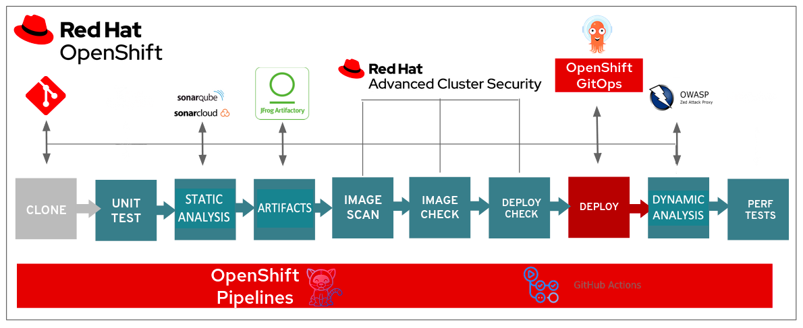

# Platform Secuirty Tools
Here you will find details on security tooling used by platform administrations and available to product teams.

* [**Pipeline templates (includes static and dynamic analysis)**](#pipeline-templates-includes-static-and-dynamic-analysis)
* [**Container image scanning (ACS, Xray)**](#container-image-scanning-acs-xray)
* [**Container runtime security**](#container-runtime-security)
* [**Secrets management**](#secrets-management)
* [**Logging and monitoring (EKS, Kibana, Graphana, Sysdig Monitor, SIEM, Uptime, Status)**](#logging-and-monitoring-eks-kibana-graphana-sysdig-monitor-siem-uptime-status)
* [**Related pages**](#other-important-considerations)

<!-- ### End of "On this page" --> 
---

## Pipeline templates (includes static and dynamic analysis)

In order to reduce effort in implementing secure tools into a build pipeline, we have developed pipeline templates that include components for build, aas well as static and dynamic vulnerability scanning.  
* [Access Pipeline templates](https://github.com/bcgov/Security-pipeline-templates/)

Here is a representation of what an application build pipeline should look like:

The pipeline templates above make it easier to include the tools described below:
* [SonarQube in the BC Gov Private Cloud PaaS](/reusable-services-list/#sonarqube-in-the-bc-gov-private-cloud-paas)
* [OWASP ZAP Security Vulnerability Scanning](/reusable-services-list/#owasp-zap-security-vulnerability-scanning)

### Scanning tools roles 

* **Static Analysis (i.e. SonarX, CodeQL)** identifies coding issues that could lead to compromise, back doors, secrets, etc
* **Dynamic Analysis (i.e. OWASP ZAP)** tests against a live version of app for injection, Cross-site scripting (XSS), and other [common web attacks](https://owasp.org/www-project-top-ten/)
* **Image Analysis** ensures image components are up-to-date and not vulnerable to [known exploits](https://cve.mitre.org/) and through the  [national vulnerability database](https://nvd.nist.gov/).

## Container image scanning (ACS, Xray)
Image scanning/analysis comes in 2 forms - 1 active (RedHat Advanced Cluster Security - ACS), 1 passive (XRay).

### ACS

This tool allows us to scan image registries and running containers for image vulnerabilities.  
* It allows us to create policies at build, deploy, and runtime.  
* It can also help in defining network security policies for your application and visualizing component communications.

Scoped access is granted based on identification as a Product Owner or Technical Lead in the OpenShift Product Registry.  
Developer access can be granted by request.  Requests must include the following:
- Namespaces
- Product owner approval

For further information:
* [Access ACS](https://acs.developer.gov.bc.ca)
* Learn about our platform's [cluster security](https://digital.gov.bc.ca/cloud/services/private/products-tools/cluster-security/)
* Learn about [advanced cluster security kubernetes](https://www.redhat.com/en/technologies/cloud-computing/openshift/advanced-cluster-security-kubernetes)
* Sign up for an [ACS workshop with RedHat](https://redhat-scholars.github.io/acs-workshop/acs-workshop/index.html)

### XRay

An add-on capability to Artifactory, XRay scans images and other artifacts for component vulnerabilities.  Anyone with access to an image or artifact within Artifactory can see the XRay tab as part of the image/artifact details, and see what vulnerable components lie within, and what version will correct that deficiency. 
 * Get access to [Artifactory](https://artifacts.developer.gov.bc.ca/ui/login/)

## Container runtime security

We currently have runtime policies in place for the following using ACS.  These look for things like:
* Cryto-mining
* [Integrity monitoring](https://docs.openshift.com/acs/3.66/operating/manage-security-policies.html)

Additionally, OpenShift uses [CoreOS and the CRI-O container engine](https://docs.openshift.com/container-platform/4.10/architecture/architecture-rhcos.html)

## Secrets management
**OpenShift Secrets:**

This 'secrets' store should actually only be used for configurations.  Values are encoded as base64 and **not** encrypted.  However, these 'secrets' can only be accessed with a role to a given namespace with permission to access them.  Additionally, the physical etcd volume, where OpenShift secrets are stored, is encrypted.

**Vault:**
Vault is the preferred secrets management tool to use on OpenShift.

* Find out more about the [benefits of using Vault](https://digital.gov.bc.ca/cloud/services/private/products-tools/vault/)
* [Vault secrets management service](/vault-secrets-management-service/)
* [Vault getting started guide](/vault-getting-started-guide/)

## GitOps/Cluster configuration management

Argo CD (integrated into OpenShift as the GitOps Operator) provides a GitOps capability for sync'ing a Git repository with an OpenShift configuration (platform or application)

## Logging and monitoring (ElasticSearch, Kibana, Graphana, Sysdig Monitor, SIEM, Uptime, Status)

The Platform Services team provides a number of tools to help ensure our platform and applications are behaving as expected, while allowing us to investigate anomalies.

**OpenShift UI:**

Within the OpenShift interface, project teams can view logs associated with a given pod through the Logs tab.  

**Kibana:**

This tool provides a more wholistic view of logs for an application or at the platform level, as well as providing visualization and alerting capability.
* [More on Kibana](https://kibana-openshift-logging.apps.silver.devops.gov.bc.ca/)

**Sysdig Monitor:**

This tool allows our platform admins and platform teams to build monitoring dashboards.
- Find out more about [Sysdig Monitor](https://digital.gov.bc.ca/cloud/services/private/products-tools/sysdig/)
- [Onboarding to application monitoring with Sysdig](/sysdig-monitor-onboarding/)
- [Login to Sysdig](https://app.sysdigcloud.com/#/login)

**Security Information and Event Monitoring (SIEM):**

All cluster logs (system, audit, container) are regularly sent to the Security Operations SIEM environment.  
Retention is set as follows:
- System, Container logs - 2 months
- Audit logs - 13 months

Please contact with Security Operations through your MISO if you wish to have access to your product's logs through the SIEM.  

**Uptime.com**
This tools help us to observe platform service availability.

Review the [status of the platform](https://status.developer.gov.bc.ca/)

**Contact**

For all other matters concerning security on the OpenShift Container Platform, please contact the [platform services team](mailto:PlatformServicesTeam@gov.bc.ca).

---
---
## Related pages

* [OpenShift 101 training](https://digital.gov.bc.ca/cloud/services/private/support/openshift-101/)
* [OpenShift 201 training](https://digital.gov.bc.ca/cloud/services/private/support/openshift-201/)
* [DevOps platform workshops](https://github.com/bcdevops/devops-platform-workshops)
* [Security best practices for apps](/security-best-practices-for-apps/)

